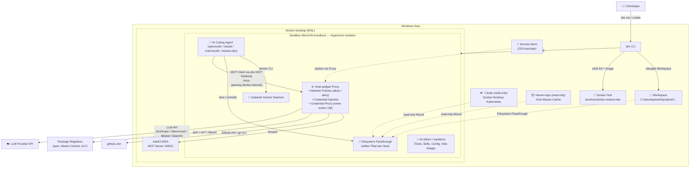

# opencode-sandbox-kit

[](https://github.com/dboeckli/opencode-sandbox-kit/actions/workflows/validate.yml)
[](https://github.com/dboeckli/opencode-sandbox-kit/actions/workflows/e2e.yml)

Docker Sandbox Kit (mixin) for OpenCode / Mammouth Code / Claude Code / Mistral Vibe with ctx7, IntelliJ MCP, Java, Maven, Docker CLI, kubectl, Helm, and Apache Kafka CLI. Enthält zusätzlich dedizierte Agent-Kits: **Mammouth Code** (`mammouth-agent/`, `kind: sandbox`, entrypoint `mammouth`) und **Mistral Vibe** (`mistral-vibe-agent/`, `kind: sandbox`, eigenes gepinntes Image, entrypoint `vibe --agent auto-approve`).

> **Setup-Anleitung:** [`INSTALL.md`](INSTALL.md) — Voraussetzungen, Docker-Desktop-Setup, IntelliJ MCP, Secrets (`sbx secret set`), Verifikation.

## Quickstart

> **IntelliJ MCP (Voraussetzung, einmalig):** Der IntelliJ-MCP-Server läuft auf dem Windows-Host und wird über den
> sbx MCP Gateway in die Sandbox geliefert. Einmalig registrieren und Sandboxes mit `--static-mcp idea` erzeugen
> (bzw. `sbx mcp load idea --sandbox <name>` für laufende Sandboxes). Details + Troubleshooting:
> [INSTALL.md → "IntelliJ MCP Server aktivieren"](INSTALL.md#3-intellij-mcp-server-aktivieren-gateway-registrierung)
> bzw. README → "IntelliJ MCP connection failed".
> ```powershell
> sbx mcp add idea --url http://localhost:64615/stream --skip-ssrf-check
> ```

### Lokale Entwicklung (opencode-sandbox-kit)

Zuerst ins geklonte Repo wechseln — die Kit-Pfade (`./opencode-agent/`, `./mammouth-agent/`, `./mistral-vibe-agent/`) sind relativ:

```powershell
cd C:\development\projects\opencode-sandbox-kit
```

Template-Version gepinnt (`0.5.0`, siehe Hinweis unten). Mammouth und Mistral Vibe (`kind: sandbox`) brauchen kein `--template` — die Template-Version steckt im spec-Image (`mammouth-agent/spec.yaml` bzw. `mistral-vibe-agent/Dockerfile`).

Das aktuelle Verzeichnis (per `cd`) wird als Workspace gemountet. **Wichtig:** bei zusätzlichen read-only Mounts muss `.` als **erster** Workspace stehen — sbx verlangt den Primary-Workspace read/write (sonst: `ERROR: primary workspace must be read/write`). Typischer Entwicklungs-Stack: `$env:USERPROFILE\.kube:ro` (Host-kubeconfig → kubectl/helm im Sandbox-Cluster) und `C:\development\maven-repo:ro` (Host-Maven-Cache → Maven nutzt den lokal gefüllten Cache statt Neu-Download; Issue #87). Mounts weglassen, wenn nicht benötigt.

**OpenCode:**

```powershell
sbx run opencode `
    --kit ./opencode-agent/ `
    --template docker/sandbox-templates:opencode-docker-0.5.0 `
    --skills=off `
    --static-mcp idea `
    . `
    "$env:USERPROFILE\.kube:ro" `
    "C:\development\maven-repo:ro"
```

**Claude Code:**

```powershell
sbx run claude `
    --kit ./opencode-agent/ `
    --template docker/sandbox-templates:claude-code-docker-0.5.0 `
    --skills=off `
    --static-mcp idea `
    . `
    "$env:USERPROFILE\.kube:ro" `
    "C:\development\maven-repo:ro"
```

**Mammouth Code:**

```powershell
sbx run ./mammouth-agent/ `
    --skills=off `
    --static-mcp idea `
    . `
    "$env:USERPROFILE\.kube:ro" `
    "C:\development\maven-repo:ro"
```

**Mistral Vibe** (gepinntes Image `domboeckli/sbx-mistral-vibe:<vibe-version>`; muss zuerst publiziert sein — Workflow `publish-mistral-vibe-image.yml`, `workflow_dispatch`):

```powershell
sbx run ./mistral-vibe-agent/ `
    --skills=off `
    --static-mcp idea `
    . `
    "$env:USERPROFILE\.kube:ro" `
    "C:\development\maven-repo:ro"
```

> **`--skills=off` (Pflicht):** Alle Sandboxes werden mit `--skills=off` erstellt — der
> Host-übergreifende **Shared-Skills-Store** (`…/DockerSandboxes/sandboxes/state/agent-skills`) wird
> **nicht** eingebunden. Seit sbx v0.43 ist der Default `readonly` (Store read-only gemountet); `off`
> schaltet ihn ganz ab. Die Sandbox bleibt damit außerhalb der geteilten Trust-Boundary;
> die Kit-Skills kommen ausschließlich aus `github.com/dboeckli/ai-agent-skills` (via
> `install-tooling-user.sh`), **nicht** vom Host. Das Flag wirkt nur bei der Sandbox-Erstellung
> (`sbx run`/`sbx create`) — bestehende Sandboxes müssen neu erstellt werden.
> Doku: https://docs.docker.com/ai/sandboxes/workflows/agent-skills/

### Kit direkt aus GitHub (ohne Clone)

Einmalig `kit.allowedSources` setzen (siehe INSTALL.md). Template gepinnt via `--template docker/sandbox-templates:<family>-0.5.0` (Mammouth: Pin im spec-Image).

Ins Projekt wechseln (wird als Workspace gemountet; `.` als erster, read/write Workspace vor den `:ro`-Mounts):

```powershell
cd C:\development\projects\mein-projekt
```

**OpenCode:**

```powershell
sbx run opencode `
    --kit "git+https://github.com/dboeckli/opencode-sandbox-kit.git#dir=opencode-agent" `
    --template docker/sandbox-templates:opencode-docker-0.5.0 `
    --skills=off `
    --static-mcp idea `
    . `
    "$env:USERPROFILE\.kube:ro" `
    "C:\development\maven-repo:ro"
```

**Claude Code:**

```powershell
sbx run claude `
    --kit "git+https://github.com/dboeckli/opencode-sandbox-kit.git#dir=opencode-agent" `
    --template docker/sandbox-templates:claude-code-docker-0.5.0 `
    --skills=off `
    --static-mcp idea `
    . `
    "$env:USERPROFILE\.kube:ro" `
    "C:\development\maven-repo:ro"
```

**Mammouth Code:**

```powershell
sbx run "git+https://github.com/dboeckli/opencode-sandbox-kit.git#dir=mammouth-agent" `
    --skills=off `
    --static-mcp idea `
    . `
    "$env:USERPROFILE\.kube:ro" `
    "C:\development\maven-repo:ro"
```

**Mistral Vibe:**

```powershell
sbx run "git+https://github.com/dboeckli/opencode-sandbox-kit.git#dir=mistral-vibe-agent" `
    --skills=off `
    --static-mcp idea `
    . `
    "$env:USERPROFILE\.kube:ro" `
    "C:\development\maven-repo:ro"
```

> **Template-Version (gepinnt):** Alle Kits nutzen Template-Tag **`0.5.0`** (2026-08-26).
> - **OpenCode / Mammouth**: `docker/sandbox-templates:opencode-docker-0.5.0`
> - **Claude (Home)**: `docker/sandbox-templates:claude-code-docker-0.5.0`
> - **Mistral Vibe**: `docker/sandbox-templates:shell-docker-0.5.0` (Basis des eigenen Vibe-Images)
>
> Die **Version** (gilt für alle Kits) ist mehrfach gepinnt und wird auf Konsistenz geprüft:
> explizit als Konstante in `local-test/local-test-kits.py` (Pin der lokalen Tests, Renovate-managed),
> als `TEMPLATE_VERSION` in `.github/workflows/validate.yml` + `e2e.yml` (Renovate-managed, wie
> `SBX_VERSION`) sowie als Mirror im `sandbox.image` von `mammouth-agent/spec.yaml`. Das Mixin-Kit
> (`opencode-agent/`) pinnt das Template per
> `--template docker/sandbox-templates:<template>-<version>` im Start-Command.
> `python local-test/local-test-kits.py --validate-only` prüft die Pins gegen die Docker-Hub-Tags und
> **warnt** (gelb), sobald ein neuerer Tag existiert (`opencode-docker` ODER `claude-code-docker`);
> bei Drift zwischen Konstante/Workflows/spec-Image schlägt der Check fehl. Die Test-Sandboxes der
> Mixin-Szenarien werden mit der expliziten `TEMPLATE_VERSION`-Konstante erstellt (`--template ...`).

### Ubuntu-WSL

Windows-Dateipfad im WSL-Format (`/mnt/c/...`) verwenden; Template gepinnt via `--template` (Mammouth: Pin im spec-Image). Ins Projekt wechseln (wird als Workspace gemountet; `.` als erster, read/write Workspace vor den `:ro`-Mounts); Mounts: kubeconfig `$HOME/.kube:ro` (WSL-Home; bei Windows-seitiger kubeconfig `/mnt/c/Users/<user>/.kube:ro`) und Host-Maven-Cache `/mnt/c/development/maven-repo:ro`.

```bash
cd /mnt/c/development/projects/spring-6-reactive
```

**OpenCode:**

```bash
sbx run opencode \
    --kit "git+https://github.com/dboeckli/opencode-sandbox-kit.git#dir=opencode-agent" \
    --template docker/sandbox-templates:opencode-docker-0.5.0 \
    --skills=off \
    --static-mcp idea \
    . \
    "$HOME/.kube:ro" \
    "/mnt/c/development/maven-repo:ro"
```

**Claude Code:**

```bash
sbx run claude \
    --kit "git+https://github.com/dboeckli/opencode-sandbox-kit.git#dir=opencode-agent" \
    --template docker/sandbox-templates:claude-code-docker-0.5.0 \
    --skills=off \
    --static-mcp idea \
    . \
    "$HOME/.kube:ro" \
    "/mnt/c/development/maven-repo:ro"
```

**Mammouth Code:**

```bash
sbx run "git+https://github.com/dboeckli/opencode-sandbox-kit.git#dir=mammouth-agent" \
    --skills=off \
    --static-mcp idea \
    . \
    "$HOME/.kube:ro" \
    "/mnt/c/development/maven-repo:ro"
```

**Mistral Vibe:**

```bash
sbx run "git+https://github.com/dboeckli/opencode-sandbox-kit.git#dir=mistral-vibe-agent" \
    --skills=off \
    --static-mcp idea \
    . \
    "$HOME/.kube:ro" \
    "/mnt/c/development/maven-repo:ro"
```

### Kit auf eine bestehende Sandbox anwenden

Restartet die Sandbox, VM-State bleibt — OpenCode/Claude nutzen das `opencode-agent`-Kit, Mammouth das `mammouth-agent`-Kit, Mistral Vibe das `mistral-vibe-agent`-Kit:

```powershell
sbx kit add <sandbox-name> `
    "git+https://github.com/dboeckli/opencode-sandbox-kit.git#dir=opencode-agent"
```

```powershell
sbx kit add <sandbox-name> `
    "git+https://github.com/dboeckli/opencode-sandbox-kit.git#dir=mammouth-agent"
```

```powershell
sbx kit add <sandbox-name> `
    "git+https://github.com/dboeckli/opencode-sandbox-kit.git#dir=mistral-vibe-agent"
```

Die Sandbox ist eine MicroVM (nerdbox) mit Hypervisor-Isolation, die `sbx` über Docker Desktop orchestriert — kein Container im Host-Daemon. Der IntelliJ-MCP-Server läuft auf dem Host (`localhost:64615`, Port 64615 seit IDEA 2026.2.2) und wird über den **sbx MCP Gateway** (`mcp-gateway.docker.internal`, host-seitig registriert via `sbx mcp add`) in die Sandbox geliefert.

## Architektur



### Docker CLI in der Sandbox

Das Kit installiert die Docker CLI (statisches Binary). Jede Sandbox hat einen **isolierten Docker Daemon**
im eigenen MicroVM – kein Host-Socket-Mount nötig. Docker-Befehle funktionieren direkt.

> Der Docker Socket kann nur beim **Erstellen** der Sandbox gemountet werden, nicht nachträglich.

> **Host-Daemon-Zugriff (optional):** [`INSTALL.md`](INSTALL.md#2-docker-desktop-konfigurieren) — Docker Desktop
> "Expose daemon on tcp://localhost:2375 without TLS" aktivieren und `export DOCKER_HOST=tcp://host.docker.internal:2375` setzen.

### Netzwerk: Deny-by-Default mit Allow-Liste

Die Sandbox hat eine **Allow-Liste** für ausgehende Verbindungen (`permissions.network.allow`) — nur gelistete
Domains sind erreichbar, alles andere wird geblockt (HTTP 403, `default-deny`). Requests zu nicht-whitelisted
Hosts werden zwar von den Agent-Tools versucht, kommen aber nie nach außen.

**Wie sie durchgesetzt wird:** Erzwungen wird die Liste nicht vom Kit, sondern von der Sandbox selbst — über den
**Sandbox-Proxy** (`mcp-gateway`, erreichbar als `mcp-gateway.docker.internal`). Er ist der einzige
Netzwerk-Ausgang der Sandbox und blockt jeden Request an nicht-whitelisted Hosts mit HTTP 403 — der Request
verlässt die Sandbox nie. Derselbe Proxy übernimmt auch die **Credential-Injection**: Er tauscht den
`proxy-managed`-Platzhalter transparent gegen die echten API-Keys (z. B. Context7/DeepSeek) — der Key liegt nie
im Filesystem. Der `mcp-gateway`-Eintrag in der MCP-Liste des Agents (z. B. „mcp-gateway Connected“ in OpenCode)
ist genau dieser Proxy: kein Fehler und kein Kit-Bestandteil, sondern Sandbox-Infrastruktur. Bei den Template-basierten
Agenten (OpenCode/Mammouth/Claude) trägt ihn das Template automatisch in die Agent-Config ein; beim Mistral-Vibe-Kit
verdrahtet ihn das Kit selbst (`~/.vibe/config.toml`).

**`network-policy.md` ist rein informativ:** Die Allow-Liste ist zusätzlich in den Agent-Instructions
dokumentiert (`~/.config/opencode/network-policy.md`, `~/.claude/network-policy.md`, in den Agent-Kits
`~/.config/mammouth/network-policy.md` bzw. `~/.vibe/network-policy.md`), damit der Agent geblockte Calls von vornherein vermeidet (Token-Kosten) — erzwingen
tut sie nichts. Das Enforcement passiert ausschließlich am Sandbox-Proxy. Beim Anpassen der Liste in
`opencode-agent/spec.yaml` muss diese Dokumentation synchron gehalten werden.

## Dual Agent Support

Das Kit funktioniert mit **OpenCode, Claude Code, Mammouth Code und Mistral Vibe** – der Agent wird nicht vom Kit bestimmt,
sondern vom Template bzw. dem Kit-Image beim `sbx run`:

| Agent | Template | Kit |
|-------|----------|-----|
| OpenCode | `opencode-docker` (Pin `0.5.0`) | `opencode-agent/` (Mixin) |
| Claude Code | `claude-code-docker` (Pin `0.5.0`) | `opencode-agent/` (Mixin) |
| Mammouth Code | `opencode-docker` (Pin `0.5.0`) | `mammouth-agent/` (`kind: sandbox`, Pin im spec-Image) |
| Mistral Vibe | `shell` (Pin `0.5.0`, im eigenen Image) | `mistral-vibe-agent/` (`kind: sandbox`, eigenes Image `domboeckli/sbx-mistral-vibe`) |

Die mehrzeiligen Start-Commands stehen im [Quickstart](#quickstart) oben.

> **IntelliJ MCP via sbx MCP Gateway:** Einmalig `sbx mcp add idea --url http://localhost:64615/stream --skip-ssrf-check`
> (Host-Loopback, SSRF-Guard umgehen), dann `--static-mcp idea` beim Erzeugen oder `sbx mcp load idea --sandbox <name>`.
> Alle vier erhalten dieselben Tools (JDK, Maven, Docker CLI, Helm, Apache Kafka CLI, Skills, ctx7) und den IntelliJ MCP über den Gateway
> (`mcp-gateway_<tool>` in OpenCode/Mammouth/Mistral Vibe, `mcp__mcp-gateway__<tool>` in Claude Code). Die jeweilige
> Konfiguration wird automatisch gelesen:

- **OpenCode**: `~/.config/opencode/opencode.jsonc` + `~/.config/opencode/AGENTS.md` — Modell `deepseek/deepseek-v4-flash`
- **Claude Code**: `~/.claude/settings.json` + `~/.claude/CLAUDE.md`
- **Mammouth Code**: `~/.config/mammouth/opencode.jsonc` + `~/.config/mammouth/AGENTS.md`
- **Mistral Vibe**: `~/.vibe/config.toml` (MCP-Gateway) + `~/.vibe/hooks.toml` (Read-only-Guard) + `~/.vibe/AGENTS.md`

### Mammouth Code Agent-Kit

[Mammouth Code](https://info.mammouth.ai/docs/mammouth-code/) ist ein Open-Source-Fork von OpenCode.
Da `sbx` keinen eingebauten `mammouth`-Agenten kennt, liegt unter `mammouth-agent/` ein **eigenes
Sandbox-Kit** (`kind: sandbox`, Name `mammouth`) – analog zum Amp-Beispiel aus der Docker-Doku:

- **Base-Image**: `docker/sandbox-templates:opencode-docker-0.5.0` (Mammouth ist ein OpenCode-Fork;
  Version gepinnt im `sandbox.image` der spec, siehe Abschnitt "Template-Version (gepinnt)")
- **Entrypoint**: `mammouth` (direkt, ohne Template-Umweg)
- **Auth**: `credentials[].apiKey` für `api.mammouth.ai` (`name: MAMMOUTH_API_KEY`, `proxyManaged: true`,
  `inject` als `Authorization: Bearer`) — kit-spec v2
- **Tools**: installiert dieselben Tools wie das Mixin-Kit (JDK, Maven, Docker CLI, kubectl, Helm, Apache Kafka CLI, ctx7, Skills)
- **Config**: `~/.config/mammouth/opencode.jsonc` + `~/.config/mammouth/AGENTS.md`

Die Konfiguration liegt unter `~/.config/mammouth/` (XDG-app `mammouth`):

- **Modell**: `deepseek/deepseek-v4-flash` (DeepSeek V4 Flash) als Default
- **IntelliJ MCP**: über den sbx MCP Gateway (`mcp-gateway_<tool>`), keine direkte `mcp.idea`-Config
- **Plugins**: Startup-Checks + Auto-Session (identisch zu OpenCode, da Fork)
- **PATH**: `mammouth`-Binary via Symlink `/usr/local/bin/mammouth` aufgelöst; `JAVA_HOME` via Kit-`environment.variables` (v2)

**Installation** — das Agent-Kit installiert Mammouth automatisch beim Sandbox-Build, gepinnt auf
**v1.18.31.1** (`curl -fsSL https://code.mammouth.ai/install.sh | VERSION=1.18.31.1 bash` als User 1000,
Pin via Renovate `mammouth-ai/code`; `local-test-kits.py --validate-only` warnt bei neuerem
GitHub-Release) und legt einen Symlink `/usr/local/bin/mammouth` an, damit der Entrypoint den
Agenten findet. Manuell nur nötig, wenn die Sandbox bereits läuft:

```bash
curl -fsSL https://code.mammouth.ai/install.sh | VERSION=1.18.31.1 bash
```

**Update/Uninstall:** `mammouth upgrade` bzw. `mammouth uninstall`.

> **Auth / Secret / Verifikation:** siehe [`INSTALL.md`](INSTALL.md#5-secrets-registrieren) — API-Key, `sbx secret set mammouth`, Platzhalter-Check.

### Mistral Vibe Agent-Kit

[Mistral Vibe](https://github.com/mistralai/mistral-vibe) ist Mistrals Open-Source-Coding-Agent (Python-CLI,
PyPI `mistral-vibe`). Da `sbx` keinen eingebauten `mistral-vibe`-Agenten kennt und Vibe kein vorgefertigtes
`docker/sandbox-templates`-Image ist, liegt unter `mistral-vibe-agent/` ein **eigenes Sandbox-Kit**
(`kind: sandbox`, Name `mistral-vibe`) — nach dem [Docker-Guide](https://docs.docker.com/guides/mistral-vibe-sandbox/):

- **Base-Image**: eigenes, gepinntes Image `domboeckli/sbx-mistral-vibe:<vibe-version>` — gebaut aus
  `docker/sandbox-templates:shell-docker-0.5.0` + `uv tool install mistral-vibe==<pin>` (siehe `mistral-vibe-agent/Dockerfile`).
  Publiziert **multi-arch (linux/amd64 + linux/arm64)** mit provenance/SBOM via
  `.github/workflows/publish-mistral-vibe-image.yml`: pro Architektur ein **nativer** Runner
  (`ubuntu-latest` / `ubuntu-24.04-arm`), Per-Arch-Image mit der Architektur im **Repo-Namen**
  (`domboeckli/sbx-mistral-vibe-amd64` / `-arm64`), danach Manifest-Merge zum Multi-Arch-Index unter
  `domboeckli/sbx-mistral-vibe` (`docker buildx imagetools create`; `uv tool install` läuft nicht unter QEMU-arm64).
- **Launch**: `sandbox.entrypoint: [vibe, "--agent", "auto-approve"]` in der spec (für `kind: sandbox` startet sbx ohne `entrypoint` die Default-Shell); das Dockerfile-`CMD` bleibt für `docker run`.
- **Auth**: Kit-deklarierter Service `mistral` → `MISTRAL_API_KEY` (Built-in-Service `mistral`, Sentinel
  `proxy-managed`, Proxy injiziert `Authorization: Bearer` für `api.mistral.ai`).
- **Default-Modell GLM-5.3-Flash (Z.AI)**: `~/.vibe/config.toml` setzt `active_model = "glm-flash"` und definiert
  Z.AI als OpenAI-kompatiblen Provider (`[[providers]]` `zai` → `https://api.z.ai/api/paas/v4`, `ZAI_API_KEY`;
  `[[models]]` `glm-flash` → `glm-5.3-flash`). GLM-5.3-Flash gibt es **nur direkt bei Z.AI** (nicht über Mistral);
  Kit-Service `zai` (`sbx secret set zai`, Key: https://z.ai/manage-apikey/apikey-list).
- **Alternative ohne Z.AI-Key**: Mistral hostet GLM 5.3 selbst (`zai-glm-5-3`, Alias `glm`, Provider `mistral`,
  gleiche `MISTRAL_API_KEY`) — in der TUI per `/model` wählbar.
- **Config**: `~/.vibe/config.toml` (MCP-Gateway auf `http://mcp-gateway.docker.internal/mcp` + GLM-Provider/-Modelle),
  `~/.vibe/hooks.toml` + `~/.config/sandbox-kit/vibe-mcp-guard.py` (Read-only-Guard für die IntelliJ-MCP-Tools,
  da `auto-approve` das Permission-System umgeht) und `~/.vibe/AGENTS.md`.
- **Tools**: dieselben wie die anderen Kits (JDK, Maven, Docker CLI, kubectl, Helm, Apache Kafka CLI, ctx7, Skills).

> **Modell-Verfügbarkeit (wichtig):** **GLM-5.3-Flash** (`glm-5.3-flash`) gibt es **nur direkt bei Z.AI**
> (`api.z.ai`, Provider `zai`, `ZAI_API_KEY`, `sbx secret set zai`) — **nicht über Mistral**. Über Mistral
> (la Plateforme) sind nur **`zai-glm-5-3`** und **`zai-glm-5-2`** verfügbar (Provider `mistral`, `MISTRAL_API_KEY`).
> Deshalb ist GLM-5.3-Flash der Default über den Z.AI-Provider; `glm` (Mistral-hosted `zai-glm-5-3`) ist die
> key-freie Alternative.

> **Image-Publish:** Das Image wird in CI gebaut/gepusht (multi-arch amd64+arm64, provenance/SBOM; native Runner + `imagetools create`). Der e2e-Workflow
> ruft den (auch manuell per `workflow_dispatch` startbaren) `publish-mistral-vibe-image.yml` als
> `publish-image`-Job **vor** der Szenario-Matrix auf — so existiert das Image für das `mistral-vibe`-Szenario
> bei jedem Push/PR/Nightly-Lauf. Manuell: Workflow `Publish Mistral Vibe image` → *Run workflow*.
>
> **Tags:** `master`/`main` → `<pin>` (z. B. `2.25.5`) **und** `latest`. Feature-Branch/PR → semver-Prerelease
> `<pin>-<branch-slug>.<YYYYMMDDHHMMSS>` (z. B. `2.25.5-feature-116-mistral-vibe-agent.20260920055746`)
> plus beweglicher Tag `<branch-slug>`. Das e2e reicht den Feature-Tag per `--kit-arg imageTag=<tag>` an das
> Kit durch (`spec.yaml` → `args.imageTag`), testet also genau den Branch-Build.
>
> **Lokal (Windows-Host):** IntelliJ-Run-Config **`publish-mistral-vibe-image`** (baut + pusht) — Tag wie beim
> Feature-Branch-Build (`<pin>-<branch-slug>.<timestamp>`, semver) **plus** beweglicher Tag `local`.
>
> Build + push + lokal laden:
> ```powershell
> python local-test\publish-mistral-vibe-image.py
> ```
> Nur pushen:
> ```powershell
> python local-test\publish-mistral-vibe-image.py --no-load
> ```
> Nur bauen:
> ```powershell
> python local-test\publish-mistral-vibe-image.py --build-only
> ```
> Neben dem Push in die Registry wird das Image in den **lokalen Docker-Daemon** geladen (zweiter, gecachter
> Build ohne provenance/SBOM — der Docker-Exporter kann keine Attestations laden).
> Voraussetzung: `docker` (Docker Desktop) mit eingeloggtem Docker-Hub-Account (read/write). Der Vibe-Pin und
> `args.imageTag.default` in `spec.yaml` werden per Renovate (PyPI `mistral-vibe`) gemeinsam aktualisiert.

> **Auth / Secret / Verifikation:** siehe [`INSTALL.md`](INSTALL.md#mistral-authentication) — `sbx secret set mistral`, Platzhalter-Check.

### Claude Code Konfiguration

`~/.claude/settings.json` enthält:

- **Modell**: `claude-sonnet-4-6` als Default (`"model"`). Zusätzlich per Env-Variablen abgesichert
  (`ANTHROPIC_DEFAULT_SONNET_MODEL` + `ANTHROPIC_MODEL` via Kit-`environment.variables`), damit das Template
  die settings.json nicht mit einem Default-Modell (Opus 5) überschreiben kann.
- **IntelliJ MCP**: über den sbx MCP Gateway (`mcp__mcp-gateway__<tool>`), keine direkte `mcpServers.idea`-Config
- **StatusLine**: `bash ~/.claude/statusline.sh` – zeigt Modell, Kontext-Tokens, Kosten, geänderte Zeilen und Session-Dauer
- **SessionStart-Hook**: führt die Sandbox-Checks aus und übergibt den Report als System-Message
  (StatusLine + Hooks liegen in `managed-settings.json` unter `/etc/claude-code/` – höchste Precedence,
  Template-sicher, kein Settings-Race beim Start, siehe [session-start-hook-fix.md](docs/session-start-hook-fix.md))
- **Permission-Whitelist + Run-Config-Guard**: siehe Abschnitt "IntelliJ MCP Zugriff einschränken"

> **Hinweis:** Das claude-code-docker-Template überschreibt `~/.claude/settings.json` beim Start (u.a. mit
> `apiKeyHelper: echo proxy-managed`, `defaultMode: bypassPermissions`). Das Modell wird deshalb nicht nur in
> der settings.json gesetzt, sondern zusätzlich fest über die Env-Variablen erzwungen. Nach Änderungen am
> Kit die Sandbox neu erstellen (bzw. `sbx kit add`), damit die Env-Variablen greifen.

Die StatusLine (`~/.claude/statusline.sh`) wird beim Sandbox-Build aus
[dboeckli/ai-agent-skills](https://github.com/dboeckli/ai-agent-skills) installiert.

## Automatisierter Kit-Test

Die 4 Agent-Szenarien (OpenCode, Claude Home, Mammouth, Mistral Vibe) lassen sich lokal automatisiert testen —
`local-test-kits.py` (cross-platform, Windows + Linux/macOS) validiert alle Kits, prüft die
Secrets, baut pro Szenario eine Sandbox, prüft Tools/Config/Startup-Checks und räumt danach auf.

Als **Workspace** mounten die Szenarien den **Repo-Root** (`--workspace <pfad>` bzw. `$WORKSPACE_DIR`
übersteuert; Default ist nicht das Aufrufverzeichnis). Der Test startet den Agenten nicht und schreibt
nichts ins Workspace.

Alle 4 Szenarien (ohne `--keep`: Sandboxes werden wieder entfernt):

```bash
python local-test/local-test-kits.py
```

Sandboxes nach dem Test behalten:

```bash
python local-test/local-test-kits.py --keep
```

Nur Kit-Validierung, keine Sandboxes:

```bash
python local-test/local-test-kits.py --validate-only
```

Lokales Testen in **Windows PowerShell** (Docker Desktop nativ):

Alle 4 Szenarien (ohne `--keep`: Sandboxes werden wieder entfernt):

```powershell
python .\local-test\local-test-kits.py
```

Sandboxes nach dem Test behalten:

```powershell
python .\local-test\local-test-kits.py --keep
```

Nur Kit-Validierung, keine Sandboxes:

```powershell
python .\local-test\local-test-kits.py --validate-only
```

Voraussetzungen: Docker läuft (auf Windows nativ oder im Ubuntu-WSL-Setup), `sbx` im PATH,
globale Secrets gesetzt (`github`, `github-maven`, `anthropic`, `mammouth`, `mistral`, `context7`).
Das Mistral-Vibe-Szenario nutzt lokal den zuletzt **lokal** gebauten Stand (`domboeckli/sbx-mistral-vibe:local`, gesetzt von der Run-Config `publish-mistral-vibe-image`) — also vorher einmal `python local-test\publish-mistral-vibe-image.py` ausführen. CI/e2e übergibt stattdessen den Feature-Tag (`VIBE_IMAGE_TAG`).

### GitHub Actions (CI)

Die Tests laufen zusätzlich automatisiert in GitHub Actions (`.github/workflows/`):

- **`validate.yml`** — bei jedem Push/PR + nightly (03:00 UTC): installiert eine **gepinnte `sbx`-Version**
  (`SBX_VERSION`, aktuell `v0.43.0`), validiert alle Kits (`sbx kit validate ./opencode-agent/`,
  `./mammouth-agent/`, `./mistral-vibe-agent/`) und prüft, dass die Install-Skript-Kopien
  (`files/home/.local/bin/`) in allen Kits identisch sind, sowie dass der Vibe-Image-Tag in
  `mistral-vibe-agent/spec.yaml` zum `ARG VIBE_VERSION` im Dockerfile passt.
- **`e2e.yml`** — bei jedem Push/PR + nightly (03:05 UTC, nach `validate.yml`): baut echte Sandboxes für
  alle 4 Szenarien (`local-test-kits.py opencode|claude|mammouth|mistral-vibe --ci`) mit KVM-Zugriff,
  Docker-Hub-Login (`DOCKER_USERNAME`/`DOCKER_PAT`) und Fake-API-Keys (nur Proxy-Wiring, keine echten Calls).
  Fork-PRs laufen nicht (keine Secrets-Exposition).
- **`publish-mistral-vibe-image.yml`** — baut/publiziert das gepinnte Vibe-Image (multi-arch amd64+arm64 über native Runner + `imagetools create`, provenance/SBOM)
  auf Docker Hub. Wird vom `e2e`-Workflow als `publish-image`-Job vor der Matrix aufgerufen; zusätzlich manuell
  via `workflow_dispatch` (Build-only möglich über den `push`-Input).

> Die **gepinnte `sbx`-Version** (`SBX_VERSION`) wird von Renovate aktualisiert
> (`customManager` für `docker/sbx-releases`, `github-releases`-Datasource).
>
> Die Offline-Referenz `opencode-agent/files/home/sbx-cli.md` (→ `~/sbx-cli.md` in der Sandbox) wird per
> `python local-test/regenerate-sbx-doc.py [<version>]` aus der Release-Binary neu erzeugt
> (Default: `SBX_VERSION` aus `validate.yml`). `local-test-kits.py --validate-only` vergleicht die
> dokumentierte Version mit dem gepinnten `SBX_VERSION` und schlägt fehl bei Abweichung
> (inkl. Hinweis aufs Regen-Skript).
>
> `--validate-only` prüft zusätzlich die **Template-Pin** (explizite `TEMPLATE_VERSION`-Konstante in
> `local-test-kits.py`, Drift-Check gegen `TEMPLATE_VERSION` in `.github/workflows/validate.yml`/`e2e.yml`
> und das Mammouth-spec-Image) gegen die Docker-Hub-Tags (`docker/sandbox-templates`), die
> **Mammouth-CLI-Pin** (`VERSION=` im spec-install) gegen das latest GitHub-Release (`mammouth-ai/code`)
> und die **Mistral-Vibe-Pin** (`ARG VIBE_VERSION` im Dockerfile, Image-Tag in der spec, shell-Basis-Template)
> gegen die latest PyPI-Version (`mistral-vibe`) — alle **warnen** (gelb), sobald eine neuere Version
> existiert (Renovate-Tracking, s. o.).

## Startup Checks

Beim Start jeder Session prüft das Kit automatisch die Tooling-Verfügbarkeit
(Context7, IntelliJ MCP, gh, Java/Maven, Docker, kubectl, Helm, Kafka, Skills) und zeigt den Report als
`[startup-checks] ...` an:

```
[startup-checks] ctx7:OK intellij-mcp:OK gh:OK java/maven:OK docker:OK docker-host:FAIL kubectl:OK helm:OK kafka:OK skills:OK
```

- **OpenCode**: Ein Server-Plugin führt die Checks sofort beim Start aus, injiziert den Report in den
  System-Prompt und schreibt ihn nach `~/.config/sandbox-kit/startup-checks.report`. Ein TUI-Plugin
  (Auto-Session) startet direkt im Session-View, sodass die Sidebar mit den Blöcken **Startup checks**,
  **Skills** und **Docker / Kubernetes** sofort sichtbar ist – ohne ersten Prompt. Der **Docker / Kubernetes**-Block
  zeigt live (alle 10s, via `~/.config/sandbox-kit/check-infra.sh`) die Erreichbarkeit von isoliertem
  Docker-Daemon (`docker info`), optionalem Docker-Desktop-Host-Daemon (`docker -H tcp://host.docker.internal:2375 info`)
  und Kubernetes-Cluster (`kubectl get nodes`, gebounded per `timeout`). Self-healing: fehlt
  `~/.kube/config` (z. B. Race zwischen `setup.startup` und `.kube`-Mount), regeneriert der Check sie on-the-fly.
- **Claude Code**: Ein `SessionStart`-Hook übergibt den Report als System-Message (registriert in `managed-settings.json` unter `/etc/claude-code/`).
- **Mammouth Code** (Agent-Kit): Da Fork von OpenCode, werden dieselben Server-/TUI-Plugins aus `~/.config/mammouth/plugins/` geladen.
- **Mistral Vibe** (Agent-Kit): Kein Auto-Hook (Vibe hat keinen Session-Hook für den Report) — die Checks laufen manuell; `check-infra.sh` ist nur der Parity wegen enthalten.
- **Manuell**: `bash ~/.config/sandbox-kit/run-checks.sh`
- **Referenz**: `~/.config/sandbox-kit/startup-checks.md`

Der Agent bestätigt den Status in der ersten Antwort und schlägt bei einem `FAIL` einen Fix vor.

## Installierte Tools

| Tool | Version | Installiert in |
|------|---------|---------------|
| Liberica JDK | 25.0.4 | `/usr/local/java` |
| Apache Maven | 3.9.16 | `/opt/maven` |
| Docker CLI | 27.5.1 | `/usr/local/bin/docker` |
| Docker Compose | 5.4.0 (Plugin) | `/usr/local/lib/docker/cli-plugins/docker-compose` |
| kubectl | latest stable | `/usr/local/bin/kubectl` |
| Helm | 3.22.0 (v3) + 4.3.0 (v4) | `/usr/local/bin/helm`, `/usr/local/bin/helm4` |
| Apache Kafka CLI | 4.3.1 (Scala 2.13) | `/opt/kafka` + `kafka-*.sh`-Wrapper in `/usr/local/bin` |
| ctx7 | latest | npm global |
| skills | 1.5.21 | npm global (vercel-labs) |
| renovate | latest | npm global |
| jq | distro | apt (StatusLine-Abhängigkeit) |

`JAVA_HOME` wird via Kit-`environment.variables` in jeder Shell verfügbar gemacht (Java/Maven liegen über
Symlinks bereits in `/usr/local/bin` und damit auf dem PATH).

### Install-Skripte (Single Source of Truth)

Der komplette `setup.install`-Tooling-Block ist in alle Kit-Specs (`opencode-agent/spec.yaml`,
`mammouth-agent/spec.yaml`, `mistral-vibe-agent/spec.yaml`)
dedupliziert. Die Install-Befehle sind in **zwei gemeinsamen Skripten** gebündelt, die als identische Kopien
in den `files/home/.local/bin/`-Bundles der Kits liegen (kein separates Kanonik-Verzeichnis):

| Skript (opencode-agent/files/home/.local/bin/) | Nutzer | Inhalt |
|--------|--------|--------|
| `install-tooling.sh` | root | npm-CLIs, apt (jq/python3/pip/yaml), shfmt, JDK, Maven, Docker CLI, Compose, kubectl, Helm, Apache Kafka CLI |
| `install-tooling-user.sh` | uid 1000 | skills (`~/.agents/skills`), Claude statusline, Repsy-Doku-Checkout (`~/docs/repsy-docs`) |

Alle Specs führen nur noch `bash /home/agent/.local/bin/install-tooling*.sh` aus. `files/home/` landet **vor**
`setup.install` im Sandbox-Home (siehe [Docker Kits](https://docs.docker.com/ai/sandboxes/customize/kits/)),
Install-Befehle dürfen also auf gebundelte Dateien zugreifen.

**Granularer Install im TUI:** Die npm/apt-Pakete stehen als eigene `setup.install`-Commands direkt in
der Spec (`npm_config_bin_links=true npm install -g ctx7`, `apt-get update && apt-get install …`),
die restlichen Tools rufen `install-tooling.sh <tool>` pro Tool (`shfmt|jdk|maven|docker|compose|kubectl|helm|helm4|kafka`,
Default `all`). Dadurch zeigt die `sbx run`-Konsole **jedes Tool einzeln** als Zeile (Spinner → ✓ mit Dauer).
Das Script loggt pro Tool `phase=… start/done` + eine Zeile mit Wall-Clock-Timestamp nach
`/var/log/sbx-kit-install.log` (siehe [docs/debugging-analysis-logging.md](docs/debugging-analysis-logging.md)).

**Versionsänderungen** (JDK, Maven, Docker, Compose, Helm, Kafka, shfmt) in einer Kit-Kopie vornehmen, dann die
anderen identisch halten (`opencode-agent/files/home/.local/bin/`, `mammouth-agent/files/home/.local/bin/`,
`mistral-vibe-agent/files/home/.local/bin/`).
Der `--validate-only`-Lauf
(`local-test/local-test-kits.py`, IntelliJ-Config `local-test-kits-validate-only`) schlägt fehl, wenn die
Kit-Kopien abweichen. Renovate trackt die Versionen via `customManager` gegen **alle** Kopien.

### npm bin-links: Install vs. Laufzeit

Die global installierten npm-CLIs (ctx7, skills, prettier, renovate) werden mit explizitem Prefix
`npm_config_bin_links=true` installiert (`install-tooling.sh`) — dadurch legt npm die Bin-Links an und
die CLIs landen als Symlinks in `/usr/local/share/npm-global/bin` (auf dem PATH). Zur Laufzeit setzt das Kit
dagegen `environment.variables.npm_config_bin_links: "false"` (`opencode-agent/spec.yaml`), damit spätere npm-Aufrufe
durch den Agent keine bin-link-Seiteneffekte erzeugen. Der Unterschied ist Absicht, kein Fehler; an beiden
Stellen nichts ändern.

Verifikation in einer laufenden Sandbox: `npm config get bin-links` → `false` (das `npm_config_bin_links`-Env überschreibt den Default).

> **Helm v3 vs. v4 — beide installiert:** **v3 ist der Default auf dem PATH** (`/usr/local/bin/helm`, gepinnt auf 3.22.0); **v4 liegt parallel** als `/usr/local/bin/helm4` (4.3.0) und kann explizit aufgerufen werden. Renovate trackt beide Versionen getrennt (`HELM_VER` → v3, `HELM4_VER` → v4).

> **Apache Kafka CLI:** Die komplette Kafka-Distribution liegt unter `/opt/kafka`; für die `bin/*.sh`-Skripte
> (`kafka-topics.sh`, `kafka-console-producer.sh`, `kafka-console-consumer.sh`, `kafka-consumer-groups.sh`,
> `kafka-configs.sh`, …) legt `install-tooling.sh` dünne Wrapper in `/usr/local/bin` an, die das jeweilige
> Skript per absolutem Pfad ausführen (die Skripte lösen ihr `base_dir` über `$(dirname $0)/..` auf — ein
> Symlink würde das brechen). Voraussetzung ist das installierte JDK. Renovate trackt `KAFKA_VER` gegen
> `org.apache.kafka:kafka_2.13` (Maven Central).

### Repsy Doku (offline)

Die Repsy-Doku (Maven/Helm/NuGet/Npm/PyPI/Cargo/Docker auf `repo.repsy.io`) ist
**nicht in Context7** verfügbar. `install-tooling-user.sh` checked den Hugo-Markdown-Source beim
`setup.install` (als User 1000) offline nach `~/docs/repsy-docs/` aus — Shallow-Clone ohne
Theme-Submodule, idempotent (`git pull --ff-only` bei erneutem Install, z. B. `sbx kit add`):

```bash
git clone --depth 1 --single-branch https://github.com/repsyio/repsy-docs.git ~/docs/repsy-docs
```

Der Agent liest bei Bedarf **direkt den Markdown-Source** (`~/docs/repsy-docs/content/`,
~60 `.md`-Dateien) — token-effizienter als HTML-Parsing der gerenderten Site — und aktualisiert
per `git -C ~/docs/repsy-docs pull --ff-only`. `github.com` ist bereits in der
Network-Allowlist, daher keine spec.yaml-Änderung.
Nutzungsregeln in `opencode-agent/files/home/.config/opencode/AGENTS.md` bzw. `.claude/CLAUDE.md`.

## Skills

Das Kit installiert automatisch Skills aus [dboeckli/ai-agent-skills](https://github.com/dboeckli/ai-agent-skills) via `skills add -g --all`. Installierte Skills:

- **camel-matrix** — Camel Spring Boot Kompatibilitätsmatrix
- **cc-best-practices** — Claude Code Best Practices
- **cron-schedule-planner** — GitHub-Actions-Cron-Zeitpläne: Übersicht, Kollisionen, Umverteilung
- **project-references** — Referenzprojekt-Suche
- **skill-best-practices** — SKILL.md Schreib-Guide

Skills landen in `~/.agents/skills/` (werden als `user: "1000"` installiert).

> **API-Keys & Secrets:** [`INSTALL.md`](INSTALL.md#5-secrets-registrieren) — alle Services (`sbx secret set`), Konsolen-URLs, Proxy/Platzhalter-Details, Verifikation.

## Troubleshooting

> **Debugging, Analyzing & Logging** (Log-Dateien, `sbx exec`-Viewing, Kit-Validierung, Drift-Check,
> Blocked requests, IntelliJ MCP-Debug): [`docs/debugging-analysis-logging.md`](docs/debugging-analysis-logging.md)

### KVM Permission Denied (WSL2)

On WSL2, the sandbox VM (`nerdbox`) needs access to `/dev/kvm`. If you see:
```
failed to create VM: sailor: Hypervisor error: KVM error: Permission denied
```

User zu den Gruppen `kvm`/`sgx` hinzufügen und die `/dev/kvm`-Ownership korrigieren:

```console
sudo usermod -aG kvm $USER
sudo usermod -aG sgx $USER
sudo chgrp kvm /dev/kvm
```

Restart the sandbox daemon to pick up group changes:

```console
sbx daemon stop
```

```console
sbx daemon start --detach
```

### Remove a sandbox

```powershell
sbx rm <sandbox-name> --force
```

### Mistral Vibe: „Retrying…" / keine Antwort

Vibe-Log in der laufenden Sandbox ansehen (Retry-Grund, z. B. Rate-Limit/Quota):

```powershell
sbx exec <sandbox-name> bash -c 'tail -n 30 ~/.vibe/logs/vibe.log'
```

- `Retrying request category=rate_limited detail=HTTP 429` → Mistral-Guthaben/Rate-Limit prüfen
  (https://console.mistral.ai/billing/).
- `blocked by network policy: domain …` → fehlende Domain in `mistral-vibe-agent/spec.yaml`
  (`permissions.network.allow`, siehe auch `~/.vibe/network-policy.md`).

### IntelliJ MCP connection failed (WSL2 / Docker)

Seit Issue #57 läuft der IntelliJ MCP über den **sbx MCP Gateway** (dokumentierter Weg). Der Gateway verbindet sich
vom Windows-Host aus mit dem IntelliJ-MCP-Server (`127.0.0.1:64615`, Endpoint `/stream`; Port 64615 seit
IDEA 2026.2.2, Legacy 64342). Voraussetzungen:

Einmalig registrieren:

```powershell
sbx mcp add idea --url http://localhost:64615/stream --skip-ssrf-check
```

Sandbox mit dem MCP-Gateway erzeugen:

```powershell
sbx run opencode `
    --kit ./opencode-agent/ `
    --template docker/sandbox-templates:opencode-docker-0.5.0 `
    --skills=off `
    --static-mcp idea
```

- **Registration nötig**: Ohne `sbx mcp add idea …` und ohne `--static-mcp idea` (oder `sbx mcp load idea --sandbox`)
  sind keine IntelliJ-MCP-Tools verfügbar — der Gateway lädt nur registrierte Server.
- **Endpoint `/stream`**: Der JetBrains-Server (2026.2.1) bietet Streamable HTTP unter `/stream`
  (nicht `/sse`); `/sse` ist klassisches SSE und vom Gateway nicht nutzbar (POST `initialize` → 405).
- **`--skip-ssrf-check`**: Die SSRF-Guard blockt Loopback-Hosts; `localhost` ist hier sicher (eigener IntelliJ).
- **Registration lebt auf dem Host**: Der Gateway erreicht IntelliJ über `localhost` (Host-Seite), nicht über
  `host.docker.internal` aus der Sandbox.
- **Port ändert sich nach IDE-Update (2026.2.2 → 64615)**: Der JetBrains-MCP-Server bindet nicht zwingend dauerhaft
  denselben Port. Aktuellen Port in der IDE ablesen (**Settings → Tools → MCP Server** → Client-Config „Copy Config"),
  die Registration anpassen (`sbx mcp rm idea`, dann `sbx mcp add idea --url http://localhost:<port>/stream
  --skip-ssrf-check`) und die Sandbox mit aktualisierter Kit-Allowlist neu erzeugen (sonst blockt der Proxy den neuen
  Port mit HTTP 403). Symptom bei Port-Drift: Health-Check meldet `intellij-mcp:FAIL`, Port ist auf dem Host aber
  belegt (Listener vorhanden).
- **Port ist dynamisch — Neustart von IDEA/Rechner verliert die Verbindung**: JetBrains bestätigt, dass der
  MCP-Server seinen Port **dynamisch wählt** (YouTrack IJPL-248682). Ein Neustart kann also einen neuen Port
  vergeben → nach jedem Neustart Port prüfen und Registration/Allowlist anpassen (s.o.). Dauerlösung steht aus:
  **IJPL-207839** („Configurable MCP Server Port") ist ein offener Feature-Request — **beobachten**.
  Vollständige Analyse + Issue-Referenzen: `docs/intellij-mcp-port.md`.

> **Wichtig (Legacy, vor Issue #57):** Bei der alten Direkt-Config war die MCP-URL auf `host.docker.internal:64342/sse`
> konfiguriert und die Sandbox verband sich direkt mit dem Host. Dieser Weg ist entfernt. Für Health-Checks
> (`[startup-checks] intellij-mcp:OK`) wird die Erreichbarkeit weiterhin aus der Sandbox über
> `host.docker.internal:64615/sse` geprüft (Port 64615 seit IDEA 2026.2.2, Legacy 64342) — das bestätigt nur,
> dass IntelliJ auf dem Host läuft (Voraussetzung für den Gateway), nicht dass der Gateway verbunden ist.

**Manuelle Verifikation vom Host** (PowerShell oder WSL):

IntelliJ-Server läuft? (Host-Seite; Health-Check-Pfad wie im Sandbox-Startup-Check):

```bash
sbx exec <sandbox-name> bash -c 'curl -s -o /dev/null -w "HTTP %{http_code}\n" -m 3 http://host.docker.internal:64615/sse'
```

Registration prüfen:

```bash
sbx mcp ls
```

Gateway laden (falls Sandbox ohne `--static-mcp` erzeugt wurde):

```bash
sbx mcp load idea --sandbox <sandbox-name>
```

Erwartet (1): `HTTP 200` (das SSE-Endpoint hält die Verbindung offen — `-m 3` beendet curl nach 3s;
nur der HTTP-Code zählt, ein `FEHLER`-Exit ist dabei normal). (2) `sbx mcp ls` zeigt `idea   remote   ✓ ready`.

Falls die Gateway-Verbindung fehlschlägt (Log: `connect to idea: … Method Not Allowed`): prüfen, dass der Endpoint
`/stream` (nicht `/sse`) registriert ist — `sbx mcp inspect idea` muss `URL: http://localhost:64615/stream` zeigen.
Stelle zudem sicher, dass Port 64615 in der Windows-Firewall freigegeben ist.

## Caveats

### Kit-Spec v2 und die sbx-Version

Alle Kits (`opencode-agent/`, `mammouth-agent/`, `mistral-vibe-agent/`) sind auf die
**v2-Kit-Grammatik** migriert:
`schemaVersion: "2"`, `permissions.network.allow`, `credentials[].apiKey` (`apiKey.name` + `inject`),
`setup.install` und `setup.startup`, Top-Level `environment.variables`, `agentInstructions` sowie flacher
`sandbox.entrypoint`. Die Migration verlangt **sbx v0.38+** (strikte v2-Grammatik mit hartem
Decode-Fehler für v1-Felder in einer `"2"`-Spec). Validierung:

```bash
sbx kit validate ./opencode-agent
```

```bash
sbx kit validate ./mammouth-agent
```

```bash
sbx kit validate ./mistral-vibe-agent
```

```bash
sbx kit inspect ./opencode-agent --json | jq '.warnings'
```

Erwartet: `[]` bzw. `null`.

Migration auf das offizielle Skript aus `docker/sbx-kits-contrib`:

```bash
git clone --depth 1 https://github.com/docker/sbx-kits-contrib.git
go run scripts/migrate-v1-to-v2.go <kit-dir>
```

Offizielle v2-Referenz: https://github.com/docker/sbx-kits-contrib/blob/main/spec/SPEC-v2.md
(enthalten im `sbx-kits-contrib`-Repo; nicht in Context7, `docker/docs` dokumentiert noch v1).

### Mammouth Code wird ausschließlich über das Agent-Kit betrieben

Mammouth Code wird über das **dedizierte Agent-Kit** (`mammouth-agent/`,
`sbx run --skills=off ./mammouth-agent/`) betrieben, das Mammouth automatisch
beim Build installiert (gepinnt auf **v1.18.31.1**: `curl -fsSL https://code.mammouth.ai/install.sh |
VERSION=1.18.31.1 bash` + Symlink; Pin via Renovate). Das
`opencode-agent/`-Kit (`sbx run --skills=off opencode/claude --kit ./opencode-agent/`) ist bewusst auf OpenCode und
Claude Code fokussiert und enthält keine Mammouth-Konfiguration.

### Mistral Vibe wird ausschließlich über das Agent-Kit betrieben

Mistral Vibe wird über das **dedizierte Agent-Kit** (`mistral-vibe-agent/`,
`sbx run --skills=off ./mistral-vibe-agent/`) betrieben. Das Kit nutzt ein eigenes, gepinntes Image
(`domboeckli/sbx-mistral-vibe:<vibe-version>`), das Vibe beim Image-Build installiert — es gibt keinen
`setup.install`-Schritt für Vibe. Das Image muss vor dem ersten Start publiziert sein
(`publish-mistral-vibe-image.yml`, `workflow_dispatch`).

### Pre-installed Tools im Base Image

Das Sandbox Base-Image (`docker/sandbox-templates:opencode-docker-0.5.0`, Version gepinnt) enthält eine eigene OpenCode CLI
(aktuell `1.17.11` in der Sandbox). Das Kit überschreibt diese Version **nicht**. OpenCode ist inzwischen
bei `1.18.11` – falls nach dem Kit-Build eine ältere Version angezeigt wird, liegt das an der
vorinstallierten Version im Base-Image. Zum Aktualisieren in der Sandbox:

```
npm install -g @opencode-ai/cli
```

### Skills landen nicht bei `agent`

Falls Skills in der Sandbox nicht sichtbar sind (`ls ~/.agents/skills/` leer), liegt es meist daran,
dass der `skills add`-Befehl als `root` statt als `agent` lief. Im Kit ist `user: "1000"` gesetzt –
beim Test muss die Sandbox neu erstellt werden (`sbx template rm ...` + `sbx run ...`).

## References

- [Debugging, Analyzing & Logging](docs/debugging-analysis-logging.md)
- [sbx CLI Offline-Referenz](opencode-agent/files/home/sbx-cli.md) (`~/sbx-cli.md` in der Sandbox, v0.43.0 — generiert aus der Release-Binary)
- [GitHub Repo](https://github.com/dboeckli/opencode-sandbox-kit)
- [Docker Sandbox Kits](https://docs.docker.com/ai/sandboxes/customize/kits/)
- [Kit Spec Reference](https://docs.docker.com/ai/sandboxes/customize/kit-reference/)
- [Docker Blog — AI Coding Agent Horror Stories: Security Risks](https://www.docker.com/blog/ai-coding-agent-horror-stories-security-risks/)
