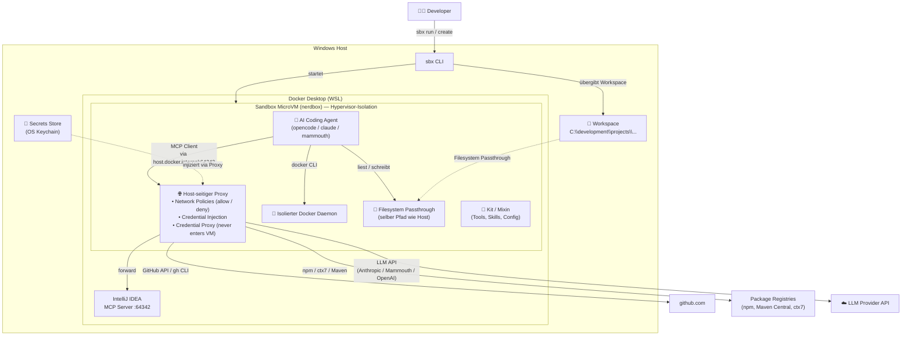

# opencode-sandbox-kit

[](https://github.com/dboeckli/opencode-sandbox-kit/actions/workflows/validate.yml)
[](https://github.com/dboeckli/opencode-sandbox-kit/actions/workflows/e2e.yml)

Docker Sandbox Kit (mixin) for OpenCode / Mammouth Code / Claude Code with ctx7, IntelliJ MCP, Java, Maven, Docker CLI, and kubectl. Enthält zusätzlich ein dediziertes **Mammouth Code Agent-Kit** (`mammouth-agent/`, `kind: sandbox`, entrypoint `mammouth`).

> **Setup-Anleitung:** [`INSTALL.md`](INSTALL.md) — Voraussetzungen, Docker-Desktop-Setup, IntelliJ MCP, Secrets (`sbx secret set`), Verifikation.

## Quickstart

```powershell
# Lokales Kit (Entwicklung) — Template-Version gepinnt (0.5.0), siehe Hinweis unten.
# Mammouth (kind:sandbox) braucht kein -t: die Template-Version steckt im spec-Image (mammouth-agent/spec.yaml).
sbx run opencode --name opencode-sandbox --kit ./opencode-agent/ -t docker/sandbox-templates:opencode-docker-0.5.0   # OpenCode
sbx run claude   --name claude-sandbox   --kit ./opencode-agent/ -t docker/sandbox-templates:claude-code-docker-0.5.0   # Claude Code (Home)
sbx run claude   --name claude-zurich    --kit ./claude-zurich-agent/ -t docker/sandbox-templates:claude-code-docker-0.5.0   # Claude Code gegen Zurich-LiteLLM-Proxy (Büro)
sbx run mammouth --name mammouth-sandbox --kit ./mammouth-agent/   # Mammouth Code (eigenes Agent-Kit)

# Kit direkt aus GitHub (ohne Clone) — einmalig kit.allowedSources setzen (siehe INSTALL.md).
# Zum Pinnen hier ebenfalls `-t docker/sandbox-templates:opencode-docker-0.5.0` (OpenCode/Mammouth)
# bzw. `-t docker/sandbox-templates:claude-code-docker-0.5.0` (Claude) ergänzen.
sbx run opencode --name opencode-sandbox `
    --kit "git+https://github.com/dboeckli/opencode-sandbox-kit.git#dir=opencode-agent"
sbx run claude --name claude-sandbox `
    --kit "git+https://github.com/dboeckli/opencode-sandbox-kit.git#dir=opencode-agent"
sbx run claude --name claude-zurich `
    --kit "git+https://github.com/dboeckli/opencode-sandbox-kit.git#dir=claude-zurich-agent"
sbx run mammouth --name mammouth-sandbox `
    --kit "git+https://github.com/dboeckli/opencode-sandbox-kit.git#dir=mammouth-agent"

# Kit mit anderem Projekt verwenden
sbx run opencode --name spring-6-reactive `
    --kit "git+https://github.com/dboeckli/opencode-sandbox-kit.git#dir=opencode-agent" `
    "C:\development\projects\spring-6-reactive"
sbx run claude --name spring-6-reactive `
    --kit "git+https://github.com/dboeckli/opencode-sandbox-kit.git#dir=opencode-agent" `
    "C:\development\projects\spring-6-reactive"
sbx run claude --name spring-6-reactive `
    --kit "git+https://github.com/dboeckli/opencode-sandbox-kit.git#dir=claude-zurich-agent" `
    "C:\development\projects\spring-6-reactive"
sbx run mammouth --name spring-6-reactive `
    --kit "git+https://github.com/dboeckli/opencode-sandbox-kit.git#dir=mammouth-agent" `
    "C:\development\projects\spring-6-reactive"
```

> **Template-Version (gepinnt):** Alle Kits nutzen Template-Tag **`0.5.0`** (2026-08-26).
> - **OpenCode / Mammouth**: `docker/sandbox-templates:opencode-docker-0.5.0`
> - **Claude (Home *und* Zurich)**: `docker/sandbox-templates:claude-code-docker-0.5.0`
>
> Die **Version** (gilt für alle drei Kits) ist mehrfach gepinnt und wird auf Konsistenz geprüft:
> explizit als Konstante in `local-test/local-test-kits.py` (Pin der lokalen Tests, Renovate-managed),
> als `TEMPLATE_VERSION` in `.github/workflows/validate.yml` + `e2e.yml` (Renovate-managed, wie
> `SBX_VERSION`) sowie als Mirror im `sandbox.image` von `mammouth-agent/spec.yaml`. Die Mixin-Kits
> (`opencode-agent/`, `claude-zurich-agent/`) pinnen das Template per
> `-t docker/sandbox-templates:<template>-<version>` im Start-Command.
> `python local-test/local-test-kits.py --validate-only` prüft die Pins gegen die Docker-Hub-Tags und
> **warnt** (gelb), sobald ein neuerer Tag existiert (`opencode-docker` ODER `claude-code-docker`);
> bei Drift zwischen Konstante/Workflows/spec-Image schlägt der Check fehl. Die Test-Sandboxes der
> Mixin-Szenarien werden mit der expliziten `TEMPLATE_VERSION`-Konstante erstellt (`-t ...`).

```bash
# Ubuntu-WSL: Windows-Dateipfad im WSL-Format (/mnt/c/...) verwenden
sbx run opencode --name spring-6-reactive \
    --kit "git+https://github.com/dboeckli/opencode-sandbox-kit.git#dir=opencode-agent" \
    "/mnt/c/development/projects/spring-6-reactive"
sbx run claude --name spring-6-reactive \
    --kit "git+https://github.com/dboeckli/opencode-sandbox-kit.git#dir=opencode-agent" \
    "/mnt/c/development/projects/spring-6-reactive"
sbx run claude --name spring-6-reactive \
    --kit "git+https://github.com/dboeckli/opencode-sandbox-kit.git#dir=claude-zurich-agent" \
    "/mnt/c/development/projects/spring-6-reactive"
sbx run mammouth --name spring-6-reactive \
    --kit "git+https://github.com/dboeckli/opencode-sandbox-kit.git#dir=mammouth-agent" \
    "/mnt/c/development/projects/spring-6-reactive"
```

```powershell
# Kubernetes-Support: kubeconfig (read-only) mounten, damit kubectl/helm im Sandbox-Cluster funktionieren
sbx run opencode --name opencode-sandbox `
    --kit ./opencode-agent/ `
    -t docker/sandbox-templates:opencode-docker-0.5.0 `
    "C:\development\projects\opencode-sandbox-kit" `
    "$env:USERPROFILE\.kube:ro"
sbx run claude --name claude-sandbox `
    --kit ./opencode-agent/ `
    -t docker/sandbox-templates:claude-code-docker-0.5.0 `
    "C:\development\projects\opencode-sandbox-kit" `
    "$env:USERPROFILE\.kube:ro"
sbx run claude --name claude-zurich `
    --kit ./claude-zurich-agent/ `
    -t docker/sandbox-templates:claude-code-docker-0.5.0 `
    "C:\development\projects\opencode-sandbox-kit" `
    "$env:USERPROFILE\.kube:ro"
sbx run mammouth --name mammouth-sandbox `
    --kit ./mammouth-agent/ `
    "C:\development\projects\opencode-sandbox-kit" `
    "$env:USERPROFILE\.kube:ro"

# Kit auf bestehende Sandbox anwenden (restartet Sandbox, VM-State bleibt)
sbx kit add opencode-sandbox `
    "git+https://github.com/dboeckli/opencode-sandbox-kit.git#dir=opencode-agent"
sbx kit add claude-sandbox `
    "git+https://github.com/dboeckli/opencode-sandbox-kit.git#dir=opencode-agent"
sbx kit add claude-zurich `
    "git+https://github.com/dboeckli/opencode-sandbox-kit.git#dir=claude-zurich-agent"
sbx kit add mammouth-sandbox `
    "git+https://github.com/dboeckli/opencode-sandbox-kit.git#dir=mammouth-agent"
```

Die Sandbox ist eine MicroVM (nerdbox) mit Hypervisor-Isolation, die `sbx` über Docker Desktop orchestriert — kein Container im Host-Daemon. IntelliJ MCP wird über `host.docker.internal:64342` erreicht.

```
┌────────────────────────────────────────────────────────────────────┐
│                         WINDOWS HOST                               │
│                                                                    │
│  ┌────────────────────────────────────────────────────────────┐    │
│  │                    IntelliJ IDEA                           │    │
│  │                                                            │    │
│  │  MCP Server läuft auf http://127.0.0.1:64342/sse           │    │
│  └──────────────────────┬─────────────────────────────────────┘    │
│                         │ Port 64342                               │
│                         ▼                                          │
│  ┌────────────────────────────────────────────────────────────┐    │
│  │              Docker Desktop (WSL)                          │    │
│  │                                                            │    │
│  │  ┌──────────────────────────────────────────────────────┐  │    │
│  │  │         HOST-SEITIGER PROXY                          │  │    │
│  │  │  - Network Policies (allow/deny)                     │  │    │
│  │  │  - Credential Injection (GitHub Token u.a.)          │  │    │
│  │  │  - Forward an IntelliJ MCP, GitHub, npm, etc.        │  │    │
│  │  └──────────┬───────────────────────────────────────────┘  │    │
│  │             │                                              │    │
│  │  host.docker.internal → Windows-Host                       │    │
│  │             │                                              │    │
│  │  ┌──────────────────────────────────────────────────────┐  │    │
│  │  │           SANDBOX (MicroVM / nerdbox)                │  │    │
│  │  │  ┌────────────────────────────────────────────────┐  │  │    │
│  │  │  │    opencode (CLI Agent)                        │  │  │    │
│  │  │  │                                                │  │  │    │
│  │  │  │  MCP Client ───► host.docker.internal:         │  │  │    │
│  │  │  │                 64342/sse ──► Proxy ──► IDEA   │  │  │    │
│  │  │  │                                                │  │  │    │
│  │  │  │  docker (CLI) ───► isolierter Docker Daemon    │  │  │    │
│  │  │  │                   (im MicroVM, nicht Host)     │  │  │    │
│  │  │  │                                                │  │  │    │
│  │  │  │  Filesystem Passthrough                        │  │  │    │
│  │  │  │  C:\dev\projects\... (selber Pfad wie Host)    │  │  │    │
│  │  │  └────────────────────────────────────────────────┘  │  │    │
│  │  │                                                      │  │    │
│  │  │  isolation: Hypervisor (KVM) + Namespaces + Proxy    │  │    │
│  │  └──────────────────────────────────────────────────────┘  │    │
│  │                                                            │    │
│  └────────────────────────────────────────────────────────────┘    │
│                                                                    │
│  📁 C:\development\projects\ ← direkt via Filesystem Passthrough   │
│                                                                    │
└────────────────────────────────────────────────────────────────────┘
```

## Architektur



### Docker CLI in der Sandbox

Das Kit installiert die Docker CLI (statisches Binary). Jede Sandbox hat einen **isolierten Docker Daemon**
im eigenen MicroVM – kein Host-Socket-Mount nötig. Docker-Befehle funktionieren direkt.

> Der Docker Socket kann nur beim **Erstellen** der Sandbox gemountet werden, nicht nachträglich.

> **Host-Daemon-Zugriff (optional):** [`INSTALL.md`](INSTALL.md#2-docker-desktop-konfigurieren) — Docker Desktop
> "Expose daemon on tcp://localhost:2375 without TLS" aktivieren und `export DOCKER_HOST=tcp://host.docker.internal:2375` setzen.

### Netzwerk: Deny-by-Default mit Allow-Liste

Die Sandbox hat eine **Allow-Liste** für ausgehende Verbindungen (`permissions.network.allow`) — nur gelistete
Domains sind erreichbar, alles andere wird geblockt (HTTP 403, `default-deny`). Requests zu nicht-whitelisted
Hosts werden zwar von den Agent-Tools versucht, kommen aber nie nach außen.

**Wie sie durchgesetzt wird:** Erzwungen wird die Liste nicht vom Kit, sondern von der Sandbox selbst — über den
**Sandbox-Proxy** (`mcp-gateway`, erreichbar als `mcp-gateway.docker.internal`). Er ist der einzige
Netzwerk-Ausgang der Sandbox und blockt jeden Request an nicht-whitelisted Hosts mit HTTP 403 — der Request
verlässt die Sandbox nie. Derselbe Proxy übernimmt auch die **Credential-Injection**: Er tauscht den
`proxy-managed`-Platzhalter transparent gegen die echten API-Keys (z. B. Context7/DeepSeek) — der Key liegt nie
im Filesystem. Der `mcp-gateway`-Eintrag in der MCP-Liste des Agents (z. B. „mcp-gateway Connected“ in OpenCode)
ist genau dieser Proxy: kein Fehler und kein Kit-Bestandteil, sondern Template-Infrastruktur der Sandbox
(`docker/sandbox-templates:opencode-docker` trägt ihn automatisch in die Agent-Config ein).

**`network-policy.md` ist rein informativ:** Die Allow-Liste ist zusätzlich in den Agent-Instructions
dokumentiert (`~/.config/opencode/network-policy.md`, `~/.claude/network-policy.md`, im Agent-Kit
`~/.config/mammouth/network-policy.md`), damit der Agent geblockte Calls von vornherein vermeidet (Token-Kosten) — erzwingen
tut sie nichts. Das Enforcement passiert ausschließlich am Sandbox-Proxy. Beim Anpassen der Liste in
`opencode-agent/spec.yaml` muss diese Dokumentation synchron gehalten werden.

## Dual Agent Support

Das Kit funktioniert mit **OpenCode, Claude Code und Mammouth Code** – der Agent wird nicht vom Kit bestimmt,
sondern vom Template beim `sbx run`:

| Agent | Template | Start-Command |
|-------|----------|---------------|
| OpenCode | `opencode-docker` (Pin `0.5.0`) | `sbx run opencode --name my-sandbox --kit ./opencode-agent/ -t docker/sandbox-templates:opencode-docker-0.5.0` |
| Claude Code | `claude-code-docker` (Pin `0.5.0`) | `sbx run claude --name my-sandbox --kit ./opencode-agent/ -t docker/sandbox-templates:claude-code-docker-0.5.0` |
| Mammouth Code | `opencode-docker` (Pin `0.5.0`, eigenes Agent-Kit `mammouth-agent/`) | `sbx run mammouth --name mammouth-sandbox --kit ./mammouth-agent/` (Pin im spec-Image) |

Alle drei erhalten dieselben Tools (JDK, Maven, Docker CLI, Skills, ctx7) und den IntelliJ MCP via
`host.docker.internal:64342`. Die jeweilige Konfiguration wird automatisch gelesen:

- **OpenCode**: `~/.config/opencode/opencode.jsonc` + `~/.config/opencode/AGENTS.md` — Modell `deepseek/deepseek-v4-flash`
- **Claude Code**: `~/.claude/settings.json` + `~/.claude/CLAUDE.md`
- **Mammouth Code**: `~/.config/mammouth/opencode.jsonc` + `~/.config/mammouth/AGENTS.md`

### Mammouth Code Agent-Kit

[Mammouth Code](https://info.mammouth.ai/docs/mammouth-code/) ist ein Open-Source-Fork von OpenCode.
Da `sbx` keinen eingebauten `mammouth`-Agenten kennt, liegt unter `mammouth-agent/` ein **eigenes
Sandbox-Kit** (`kind: sandbox`, Name `mammouth`) – analog zum Amp-Beispiel aus der Docker-Doku:

- **Base-Image**: `docker/sandbox-templates:opencode-docker-0.5.0` (Mammouth ist ein OpenCode-Fork;
  Version gepinnt im `sandbox.image` der spec, siehe Abschnitt "Template-Version (gepinnt)")
- **Entrypoint**: `mammouth` (direkt, ohne Template-Umweg)
- **Auth**: `credentials[].apiKey` für `api.mammouth.ai` (`name: MAMMOUTH_API_KEY`, `proxyManaged: true`,
  `inject` als `Authorization: Bearer`) — kit-spec v2
- **Tools**: installiert dieselben Tools wie das Mixin-Kit (JDK, Maven, Docker CLI, kubectl, ctx7, Skills)
- **Config**: `~/.config/mammouth/opencode.jsonc` + `~/.config/mammouth/AGENTS.md`

Die Konfiguration liegt unter `~/.config/mammouth/` (XDG-app `mammouth`):

- **Modell**: `deepseek/deepseek-v4-flash` (DeepSeek V4 Flash) als Default
- **IntelliJ MCP**: SSE-Endpoint `http://host.docker.internal:64342/sse`
- **Plugins**: Startup-Checks + Auto-Session (identisch zu OpenCode, da Fork)
- **PATH**: `mammouth`-Binary via Symlink `/usr/local/bin/mammouth` aufgelöst; `JAVA_HOME` via Kit-`environment.variables` (v2)

**Installation** — das Agent-Kit installiert Mammouth automatisch beim Sandbox-Build, gepinnt auf
**v1.17.11.2** (`curl -fsSL https://code.mammouth.ai/install.sh | VERSION=1.17.11.2 bash` als User 1000,
Pin via Renovate `mammouth-ai/code`; `local-test-kits.py --validate-only` warnt bei neuerem
GitHub-Release) und legt einen Symlink `/usr/local/bin/mammouth` an, damit der Entrypoint den
Agenten findet. Manuell nur nötig, wenn die Sandbox bereits läuft:

```bash
curl -fsSL https://code.mammouth.ai/install.sh | VERSION=1.17.11.2 bash
```

**Update/Uninstall:** `mammouth upgrade` bzw. `mammouth uninstall`.

> **Auth / Secret / Verifikation:** siehe [`INSTALL.md`](INSTALL.md#5-secrets-registrieren) — API-Key, `sbx secret set mammouth`, Platzhalter-Check.

### Claude Code Konfiguration

`~/.claude/settings.json` enthält:

- **Modell**: `claude-sonnet-4-6` als Default (`"model"`). Zusätzlich per Env-Variablen abgesichert
  (`ANTHROPIC_DEFAULT_SONNET_MODEL` + `ANTHROPIC_MODEL` via Kit-`environment.variables`), damit das Template
  die settings.json nicht mit einem Default-Modell (Opus 5) überschreiben kann.
- **IntelliJ MCP**: SSE-Endpoint `http://host.docker.internal:64342/sse`
- **StatusLine**: `bash ~/.claude/statusline.sh` – zeigt Modell, Kontext-Tokens, Kosten, geänderte Zeilen und Session-Dauer
- **SessionStart-Hook**: führt die Sandbox-Checks aus und übergibt den Report als System-Message
  (StatusLine + Hooks liegen in `managed-settings.json` unter `/etc/claude-code/` – höchste Precedence,
  Template-sicher, kein Settings-Race beim Start, siehe [session-start-hook-fix.md](docs/session-start-hook-fix.md))
- **Permission-Whitelist + Run-Config-Guard**: siehe Abschnitt "IntelliJ MCP Zugriff einschränken"

> **Hinweis:** Das claude-code-docker-Template überschreibt `~/.claude/settings.json` beim Start (u.a. mit
> `apiKeyHelper: echo proxy-managed`, `defaultMode: bypassPermissions`). Das Modell wird deshalb nicht nur in
> der settings.json gesetzt, sondern zusätzlich fest über die Env-Variablen erzwungen. Nach Änderungen am
> Kit die Sandbox neu erstellen (bzw. `sbx kit add`), damit die Env-Variablen greifen.

Die StatusLine (`~/.claude/statusline.sh`) wird beim Sandbox-Build aus
[dboeckli/ai-agent-skills](https://github.com/dboeckli/ai-agent-skills) installiert.

## Automatisierter Kit-Test

Die 4 Agent-Szenarien (OpenCode, Claude Home, Claude Zurich, Mammouth) lassen sich lokal automatisiert testen —
`local-test-kits.py` (cross-platform, Windows + Linux/macOS) validiert alle Kits, prüft die
Secrets, baut pro Szenario eine Sandbox, prüft Tools/Config/Startup-Checks und räumt danach auf:

```bash
python local-test/local-test-kits.py            # ohne --keep: Sandboxes werden wieder entfernt
python local-test/local-test-kits.py --keep     # Sandboxes nach dem Test behalten
python local-test/local-test-kits.py --validate-only   # nur Kit-Validierung, keine Sandboxes
```

Lokales Testen in **Windows PowerShell** (Docker Desktop nativ):

```powershell
python .\local-test\local-test-kits.py          # ohne --keep: Sandboxes werden wieder entfernt
python .\local-test\local-test-kits.py --keep   # Sandboxes nach dem Test behalten
python .\local-test\local-test-kits.py --validate-only   # nur Kit-Validierung, keine Sandboxes
```

Voraussetzungen: Docker läuft (auf Windows nativ oder im Ubuntu-WSL-Setup), `sbx` im PATH,
globale Secrets gesetzt (`github`, `anthropic`, `zurich`, `mammouth`, `context7`).

### GitHub Actions (CI)

Die Tests laufen zusätzlich automatisiert in GitHub Actions (`.github/workflows/`):

- **`validate.yml`** — bei jedem Push/PR + nightly (03:00 UTC): installiert eine **gepinnte `sbx`-Version**
  (`SBX_VERSION`, aktuell `v0.39.0`), validiert alle 3 Kits (`sbx kit validate ./opencode-agent/`,
  `./mammouth-agent/`, `./claude-zurich-agent/`) und prüft, dass die Install-Skript-Kopien
  (`files/home/.local/bin/`) in allen Kits identisch sind.
- **`e2e.yml`** — bei jedem Push/PR + nightly (03:05 UTC, nach `validate.yml`): baut echte Sandboxes für
  alle 4 Szenarien (`local-test-kits.py opencode|claude|claude-zurich|mammouth --ci`) mit KVM-Zugriff,
  Docker-Hub-Login (`DOCKER_USERNAME`/`DOCKER_PAT`) und Fake-API-Keys (nur Proxy-Wiring, keine echten Calls).
  Fork-PRs laufen nicht (keine Secrets-Exposition).

> Die **gepinnte `sbx`-Version** (`SBX_VERSION`) wird von Renovate aktualisiert
> (`customManager` für `docker/sbx-releases`, `github-releases`-Datasource).
>
> Die Offline-Referenz `opencode-agent/files/home/sbx-cli.md` (→ `~/sbx-cli.md` in der Sandbox) wird per
> `python local-test/regenerate-sbx-doc.py [<version>]` aus der Release-Binary neu erzeugt
> (Default: `SBX_VERSION` aus `validate.yml`). `local-test-kits.py --validate-only` vergleicht die
> dokumentierte Version mit dem gepinnten `SBX_VERSION` und schlägt fehl bei Abweichung
> (inkl. Hinweis aufs Regen-Skript).
>
> `--validate-only` prüft zusätzlich die **Template-Pin** (explizite `TEMPLATE_VERSION`-Konstante in
> `local-test-kits.py`, Drift-Check gegen `TEMPLATE_VERSION` in `.github/workflows/validate.yml`/`e2e.yml`
> und das Mammouth-spec-Image) gegen die Docker-Hub-Tags (`docker/sandbox-templates`) und die
> **Mammouth-CLI-Pin** (`VERSION=` im spec-install) gegen das latest GitHub-Release (`mammouth-ai/code`)
> — beide **warnen** (gelb), sobald ein neuerer Tag/Release existiert (Renovate-Tracking, s. o.).

## Startup Checks

Beim Start jeder Session prüft das Kit automatisch die Tooling-Verfügbarkeit
(Context7, IntelliJ MCP, gh, Java/Maven, Docker, kubectl, Skills) und zeigt den Report als
`[startup-checks] ...` an:

```
[startup-checks] ctx7:OK intellij-mcp:OK gh:OK java/maven:OK docker:OK docker-host:FAIL kubectl:OK helm:OK skills:OK
```

- **OpenCode**: Ein Server-Plugin führt die Checks sofort beim Start aus, injiziert den Report in den
  System-Prompt und schreibt ihn nach `~/.config/sandbox-kit/startup-checks.report`. Ein TUI-Plugin
  (Auto-Session) startet direkt im Session-View, sodass die Sidebar mit den Blöcken **Startup checks**,
  **Skills** und **Docker / Kubernetes** sofort sichtbar ist – ohne ersten Prompt. Der **Docker / Kubernetes**-Block
  zeigt live (alle 10s, via `~/.config/sandbox-kit/check-infra.sh`) die Erreichbarkeit von isoliertem
  Docker-Daemon (`docker info`), optionalem Docker-Desktop-Host-Daemon (`docker -H tcp://host.docker.internal:2375 info`)
  und Kubernetes-Cluster (`kubectl get nodes`, gebounded per `timeout`). Self-healing: fehlt
  `~/.kube/config` (z. B. Race zwischen `setup.startup` und `.kube`-Mount), regeneriert der Check sie on-the-fly.
- **Claude Code**: Ein `SessionStart`-Hook übergibt den Report als System-Message (registriert in `managed-settings.json` unter `/etc/claude-code/`).
- **Mammouth Code** (Agent-Kit): Da Fork von OpenCode, werden dieselben Server-/TUI-Plugins aus `~/.config/mammouth/plugins/` geladen.
- **Manuell**: `bash ~/.config/sandbox-kit/run-checks.sh`
- **Referenz**: `~/.config/sandbox-kit/startup-checks.md`

Der Agent bestätigt den Status in der ersten Antwort und schlägt bei einem `FAIL` einen Fix vor.

## Installierte Tools

| Tool | Version | Installiert in |
|------|---------|---------------|
| Liberica JDK | 25.0.4 | `/usr/local/java` |
| Apache Maven | 3.9.16 | `/opt/maven` |
| Docker CLI | 27.5.1 | `/usr/local/bin/docker` |
| Docker Compose | 5.4.0 (Plugin) | `/usr/local/lib/docker/cli-plugins/docker-compose` |
| kubectl | latest stable | `/usr/local/bin/kubectl` |
| Helm | 3.21.3 (v3) + 4.2.4 (v4) | `/usr/local/bin/helm`, `/usr/local/bin/helm4` |
| ctx7 | latest | npm global |
| skills | 1.5.21 | npm global (vercel-labs) |
| renovate | latest | npm global |
| jq | distro | apt (StatusLine-Abhängigkeit) |

`JAVA_HOME` wird via Kit-`environment.variables` in jeder Shell verfügbar gemacht (Java/Maven liegen über
Symlinks bereits in `/usr/local/bin` und damit auf dem PATH).

### Install-Skripte (Single Source of Truth)

Der komplette `setup.install`-Tooling-Block ist in alle drei Kit-Specs (`opencode-agent/spec.yaml`,
`mammouth-agent/spec.yaml`, `claude-zurich-agent/spec.yaml`)
dedupliziert. Die Install-Befehle sind in **zwei gemeinsamen Skripten** gebündelt, die als identische Kopien
in den `files/home/.local/bin/`-Bundles der drei Kits liegen (kein separates Kanonik-Verzeichnis):

| Skript (opencode-agent/files/home/.local/bin/) | Nutzer | Inhalt |
|--------|--------|--------|
| `install-tooling.sh` | root | npm-CLIs, apt (jq/python3/pip/yaml), shfmt, JDK, Maven, Docker CLI, Compose, kubectl, Helm |
| `install-tooling-user.sh` | uid 1000 | skills (`~/.agents/skills`), Claude statusline, Repsy-Doku-Checkout (`~/docs/repsy-docs`) |

Alle drei Specs führen nur noch `bash /home/agent/.local/bin/install-tooling*.sh` aus. `files/home/` landet **vor**
`setup.install` im Sandbox-Home (siehe [Docker Kits](https://docs.docker.com/ai/sandboxes/customize/kits/)),
Install-Befehle dürfen also auf gebundelte Dateien zugreifen.

**Granularer Install im TUI:** Die npm/apt-Pakete stehen als eigene `setup.install`-Commands direkt in
der Spec (`npm_config_bin_links=true npm install -g ctx7`, `apt-get update && apt-get install …`),
die restlichen Tools rufen `install-tooling.sh <tool>` pro Tool (`shfmt|jdk|maven|docker|compose|kubectl|helm|helm4`,
Default `all`). Dadurch zeigt die `sbx run`-Konsole **jedes Tool einzeln** als Zeile (Spinner → ✓ mit Dauer).
Das Script loggt pro Tool `phase=… start/done` + eine Zeile mit Wall-Clock-Timestamp nach
`/var/log/sbx-kit-install.log` (siehe [docs/debugging-analysis-logging.md](docs/debugging-analysis-logging.md)).

**Versionsänderungen** (JDK, Maven, Docker, Compose, Helm, shfmt) in einer Kit-Kopie vornehmen, dann die
übrigen identisch halten (`opencode-agent/files/home/.local/bin/`, `mammouth-agent/files/home/.local/bin/`,
`claude-zurich-agent/files/home/.local/bin/`). Der `--validate-only`-Lauf
(`local-test/local-test-kits.py`, IntelliJ-Config `local-test-kits-validate-only`) schlägt fehl, wenn die
drei Kit-Kopien abweichen. Renovate trackt die Versionen via `customManager` gegen **alle** Kopien.

### npm bin-links: Install vs. Laufzeit

Die global installierten npm-CLIs (ctx7, skills, prettier, renovate) werden mit explizitem Prefix
`npm_config_bin_links=true` installiert (`install-tooling.sh`) — dadurch legt npm die Bin-Links an und
die CLIs landen als Symlinks in `/usr/local/share/npm-global/bin` (auf dem PATH). Zur Laufzeit setzt das Kit
dagegen `environment.variables.npm_config_bin_links: "false"` (`opencode-agent/spec.yaml`), damit spätere npm-Aufrufe
durch den Agent keine bin-link-Seiteneffekte erzeugen. Der Unterschied ist Absicht, kein Fehler; an beiden
Stellen nichts ändern.

Verifikation in einer laufenden Sandbox: `npm config get bin-links` → `false` (das `npm_config_bin_links`-Env überschreibt den Default).

> **Helm v3 vs. v4 — beide installiert:** `kokuwaio/helm-maven-plugin` (io.kokuwa.maven, derzeit 6.17.0) ist **nicht mit Helm v4 kompatibel** (offenes Issue [#427](https://github.com/kokuwaio/helm-maven-plugin/issues/427)): Das `registry-login`-Goal übergibt die volle Registry-URL an `helm registry login` — v3 gab dafür nur eine Warnung, **v4 bricht mit `invalid reference: invalid registry` ab**. Das betrifft den `helm push`/Upload (z. B. im spring-6-reactive-Build). Ein Fix-Release existiert noch nicht (nur 6.17.1-SNAPSHOT auf master). Daher ist **v3 der Default auf dem PATH** (`/usr/local/bin/helm`, gepinnt auf 3.21.3) — das Plugin läuft über `useLocalHelmBinary=true` mit der Sandbox-Helm-Version. **v4 liegt parallel** als `/usr/local/bin/helm4` (4.2.4) und kann explizit für alles andere aufgerufen werden. Renovate trackt beide Versionen getrennt (`HELM_VER` → v3, `HELM4_VER` → v4).

### Repsy Doku (offline)

Die Repsy-Doku (Maven/Helm/NuGet/Npm/PyPI/Cargo/Docker auf `repo.repsy.io`) ist
**nicht in Context7** verfügbar. `install-tooling-user.sh` checked den Hugo-Markdown-Source beim
`setup.install` (als User 1000) offline nach `~/docs/repsy-docs/` aus — Shallow-Clone ohne
Theme-Submodule, idempotent (`git pull --ff-only` bei erneutem Install, z. B. `sbx kit add`):

```bash
git clone --depth 1 --single-branch https://github.com/repsyio/repsy-docs.git ~/docs/repsy-docs
```

Der Agent liest bei Bedarf **direkt den Markdown-Source** (`~/docs/repsy-docs/content/`,
~60 `.md`-Dateien) — token-effizienter als HTML-Parsing der gerenderten Site — und aktualisiert
per `git -C ~/docs/repsy-docs pull --ff-only`. `github.com` ist bereits in der
Network-Allowlist, daher keine spec.yaml-Änderung.
Nutzungsregeln in `opencode-agent/files/home/.config/opencode/AGENTS.md` bzw. `.claude/CLAUDE.md`.

## Skills

Das Kit installiert automatisch Skills aus [dboeckli/ai-agent-skills](https://github.com/dboeckli/ai-agent-skills) via `skills add -g --all`. Installierte Skills:

- **camel-matrix** — Camel Spring Boot Kompatibilitätsmatrix
- **cc-best-practices** — Claude Code Best Practices
- **project-references** — Referenzprojekt-Suche
- **skill-best-practices** — SKILL.md Schreib-Guide

Skills landen in `~/.agents/skills/` (werden als `user: "1000"` installiert).

> **API-Keys & Secrets:** [`INSTALL.md`](INSTALL.md#5-secrets-registrieren) — alle Services (`sbx secret set`), Konsolen-URLs, Proxy/Platzhalter-Details, Verifikation.

## Troubleshooting

> **Debugging, Analyzing & Logging** (Log-Dateien, `sbx exec`-Viewing, Kit-Validierung, Drift-Check,
> Blocked requests, IntelliJ MCP-Debug): [`docs/debugging-analysis-logging.md`](docs/debugging-analysis-logging.md)

### KVM Permission Denied (WSL2)

On WSL2, the sandbox VM (`nerdbox`) needs access to `/dev/kvm`. If you see:
```
failed to create VM: sailor: Hypervisor error: KVM error: Permission denied
```

```console
# Add user to groups
sudo usermod -aG kvm $USER
sudo usermod -aG sgx $USER

# Fix /dev/kvm group ownership
sudo chgrp kvm /dev/kvm

# Restart the sandbox daemon to pick up group changes
sbx daemon stop
sbx daemon start --detach
```

### Remove a sandbox

```powershell
sbx rm opencode-sandbox --force
```

### IntelliJ MCP connection failed (WSL2 / Docker)

Der IntelliJ MCP-Forwarder läuft auf Windows unter `127.0.0.1:64342`.

**Via `host.docker.internal` (Standard, funktioniert mit Docker Desktop unter Windows):**  
Im Sandbox-Kit ist die MCP-URL auf `host.docker.internal:64342` konfiguriert. Docker Desktop löst
diese Adresse automatisch auf den Windows-Host auf (inkl. Loopback). Funktioniert auch ohne WSL
`networkingMode=mirrored`.

> **Wichtig:** Aus dem Container heraus ist `127.0.0.1`/`localhost` der Loopback des Containers selbst,
> nicht der Host. Die MCP-URL darf daher **nicht** auf `127.0.0.1` geändert werden — das funktioniert
> nur, wenn der Agent direkt in WSL läuft (ohne Container).

**Manuelle Verifikation vom Host** (PowerShell oder WSL):

```bash
sbx exec opencode-sandbox bash -c 'curl -s -o /dev/null -w "HTTP %{http_code}\n" -m 3 http://host.docker.internal:64342/sse'
```

Erwartet: `HTTP 200` (das SSE-Endpoint hält die Verbindung offen — `-m 3` beendet curl nach 3s;
nur der HTTP-Code zählt, ein `FEHLER`-Exit ist dabei normal).

Falls `host.docker.internal` nicht verfügbar sein sollte (z. B. Docker Engine ohne Docker Desktop):
den MCP-Server im IntelliJ-Plugin auf `0.0.0.0` binden lassen und die Windows-Host-IP verwenden.
Stelle zudem sicher, dass Port 64342 in der Windows-Firewall freigegeben ist.

## Caveats

### Kit-Spec v2 und die sbx-Version

Alle drei Kits (`opencode-agent/`, `mammouth-agent/`, `claude-zurich-agent/`) sind auf die
**v2-Kit-Grammatik** migriert:
`schemaVersion: "2"`, `permissions.network.allow`, `credentials[].apiKey` (`apiKey.name` + `inject`),
`setup.install` und `setup.startup`, Top-Level `environment.variables`, `agentInstructions` sowie flacher
`sandbox.entrypoint`. Die Migration verlangt **sbx v0.38+** (strikte v2-Grammatik mit hartem
Decode-Fehler für v1-Felder in einer `"2"`-Spec). Validierung:

```bash
sbx kit validate ./opencode-agent          # und: sbx kit validate ./mammouth-agent
sbx kit inspect ./opencode-agent --output json | jq '.warnings'   # erwartet: [] bzw. null
```

Migration auf das offizielle Skript aus `docker/sbx-kits-contrib`:

```bash
git clone --depth 1 https://github.com/docker/sbx-kits-contrib.git
go run scripts/migrate-v1-to-v2.go <kit-dir>
```

Offizielle v2-Referenz: https://github.com/docker/sbx-kits-contrib/blob/main/spec/SPEC-v2.md
(enthalten im `sbx-kits-contrib`-Repo; nicht in Context7, `docker/docs` dokumentiert noch v1).

### Mammouth Code wird ausschließlich über das Agent-Kit betrieben

Mammouth Code wird über das **dedizierte Agent-Kit** (`mammouth-agent/`,
`sbx run mammouth --name mammouth-sandbox --kit ./mammouth-agent/`) betrieben, das Mammouth automatisch
beim Build installiert (gepinnt auf **v1.17.11.2**: `curl -fsSL https://code.mammouth.ai/install.sh |
VERSION=1.17.11.2 bash` + Symlink). Das
`opencode-agent/`-Kit (`sbx run opencode/claude --kit ./opencode-agent/`) ist bewusst auf OpenCode und
Claude Code fokussiert und enthält keine Mammouth-Konfiguration.

### Pre-installed Tools im Base Image

Das Sandbox Base-Image (`docker/sandbox-templates:opencode-docker-0.5.0`, Version gepinnt) enthält eine eigene OpenCode CLI
(aktuell `1.17.11` in der Sandbox). Das Kit überschreibt diese Version **nicht**. OpenCode ist inzwischen
bei `1.18.11` – falls nach dem Kit-Build eine ältere Version angezeigt wird, liegt das an der
vorinstallierten Version im Base-Image. Zum Aktualisieren in der Sandbox:

```
npm install -g @opencode-ai/cli
```

### Skills landen nicht bei `agent`

Falls Skills in der Sandbox nicht sichtbar sind (`ls ~/.agents/skills/` leer), liegt es meist daran,
dass der `skills add`-Befehl als `root` statt als `agent` lief. Im Kit ist `user: "1000"` gesetzt –
beim Test muss die Sandbox neu erstellt werden (`sbx template rm ...` + `sbx run ...`).

## References

- [Debugging, Analyzing & Logging](docs/debugging-analysis-logging.md)
- [sbx CLI Offline-Referenz](opencode-agent/files/home/sbx-cli.md) (`~/sbx-cli.md` in der Sandbox, v0.39.0 — generiert aus der Release-Binary)
- [GitHub Repo](https://github.com/dboeckli/opencode-sandbox-kit)
- [Docker Sandbox Kits](https://docs.docker.com/ai/sandboxes/customize/kits/)
- [Kit Spec Reference](https://docs.docker.com/ai/sandboxes/customize/kit-reference/)
- [Docker Blog — AI Coding Agent Horror Stories: Security Risks](https://www.docker.com/blog/ai-coding-agent-horror-stories-security-risks/)
