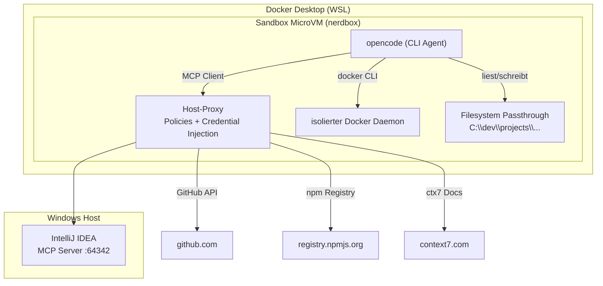

# opencode-sandbox-kit

[](https://github.com/dboeckli/opencode-sandbox-kit/actions/workflows/validate.yml)

Docker Sandbox Kit (mixin) for OpenCode development with ctx7, IntelliJ MCP, Java, Maven, Docker CLI, and kubectl.

```
┌────────────────────────────────────────────────────────────────────┐
│                         WINDOWS HOST                               │
│                                                                    │
│  ┌────────────────────────────────────────────────────────────┐    │
│  │                    IntelliJ IDEA                           │    │
│  │                                                            │    │
│  │  MCP Server läuft auf http://127.0.0.1:64342/sse           │    │
│  └──────────────────────┬─────────────────────────────────────┘    │
│                         │ Port 64342                               │
│                         ▼                                          │
│  ┌────────────────────────────────────────────────────────────┐    │
│  │              Docker Desktop (WSL)                          │    │
│  │                                                            │    │
│  │  ┌──────────────────────────────────────────────────────┐  │    │
│  │  │         HOST-SEITIGER PROXY                          │  │    │
│  │  │  - Network Policies (allow/deny)                     │  │    │
│  │  │  - Credential Injection (GitHub Token u.a.)          │  │    │
│  │  │  - Forward an IntelliJ MCP, GitHub, npm, etc.        │  │    │
│  │  └──────────┬───────────────────────────────────────────┘  │    │
│  │             │                                              │    │
│  │  host.docker.internal → Windows-Host                       │    │
│  │             │                                              │    │
│  │  ┌──────────────────────────────────────────────────────┐  │    │
│  │  │           SANDBOX (MicroVM / nerdbox)                │  │    │
│  │  │  ┌────────────────────────────────────────────────┐  │  │    │
│  │  │  │    opencode (CLI Agent)                        │  │  │    │
│  │  │  │                                                │  │  │    │
│  │  │  │  MCP Client ───► host.docker.internal:         │  │  │    │
│  │  │  │                 64342/sse ──► Proxy ──► IDEA   │  │  │    │
│  │  │  │                                                │  │  │    │
│  │  │  │  docker (CLI) ───► isolierter Docker Daemon    │  │  │    │
│  │  │  │                   (im MicroVM, nicht Host)     │  │  │    │
│  │  │  │                                                │  │  │    │
│  │  │  │  Filesystem Passthrough                        │  │  │    │
│  │  │  │  C:\dev\projects\... (selber Pfad wie Host)    │  │  │    │
│  │  │  └────────────────────────────────────────────────┘  │  │    │
│  │  │                                                      │  │    │
│  │  │  isolation: Hypervisor (KVM) + Namespaces + Proxy    │  │    │
│  │  └──────────────────────────────────────────────────────┘  │    │
│  │                                                            │    │
│  └────────────────────────────────────────────────────────────┘    │
│                                                                    │
│  📁 C:\development\projects\ ← direkt via Filesystem Passthrough   │
│                                                                    │
└────────────────────────────────────────────────────────────────────┘
```

## Usage (PowerShell on Windows)

```powershell
# Lokales Kit (Entwicklung)
sbx run opencode --name opencode-sandbox --kit .

# Kit direkt aus GitHub (ohne Clone)
sbx settings set kit.allowedSources --% "[\"docker.io/\",\"github.com/dboeckli/\"]"
sbx run opencode --name opencode-sandbox --kit "git+https://github.com/dboeckli/opencode-sandbox-kit.git"
```

The sandbox runs inside Docker Desktop. IntelliJ MCP is reached via `host.docker.internal:64342`.



### Docker CLI in der Sandbox

Das Kit installiert die Docker CLI (statisches Binary). Jede Sandbox hat einen **isolierten Docker Daemon**
im eigenen MicroVM – kein Host-Socket-Mount nötig. Docker-Befehle funktionieren direkt.

> Der Docker Socket kann nur beim **Erstellen** der Sandbox gemountet werden, nicht nachträglich.

## Installierte Tools

| Tool | Version | Installiert in |
|------|---------|---------------|
| Liberica JDK | 25.0.4 | `/usr/local/java` |
| Apache Maven | 3.9.16 | `/opt/maven` |
| Docker CLI | 27.5.1 | `/usr/local/bin/docker` |
| kubectl | latest stable | `/usr/local/bin/kubectl` |
| ctx7 | latest | npm global |
| skills | 1.5.21 | npm global (vercel-labs) |

`JAVA_HOME` und `PATH` werden via `/etc/sandbox-persistent.sh` in jeder Shell verfügbar gemacht.

Optional — Context7 API-Key für höheres Rate-Limit:

```powershell
sbx exec opencode-sandbox bash -c "echo 'export CONTEXT7_API_KEY=your-key' >> /etc/sandbox-persistent.sh"
```

## Skills

Das Kit installiert automatisch Skills aus [dboeckli/ai-agent-skills](https://github.com/dboeckli/ai-agent-skills) via `skills add -g --all`. Installierte Skills:

- **camel-matrix** — Camel Spring Boot Kompatibilitätsmatrix
- **cc-best-practices** — Claude Code Best Practices
- **project-references** — Referenzprojekt-Suche
- **skill-best-practices** — SKILL.md Schreib-Guide

Skills landen in `~/.agents/skills/` (werden als `user: "1000"` installiert).

## GitHub Authentication

Für `gh` CLI in der Sandbox ein persönliches GitHub-Token mit `repo`-Scope (Name: `opencode-sandbox-kit-github-token`) erstellen und als Secret speichern:

```powershell
sbx secret set -g github -t "<github-token>"
```

Das Token wird via Proxy automatisch injiziert – `gh auth status` funktioniert ohne weitere Konfiguration.

## Troubleshooting

### KVM Permission Denied (WSL2)

On WSL2, the sandbox VM (`nerdbox`) needs access to `/dev/kvm`. If you see:
```
failed to create VM: sailor: Hypervisor error: KVM error: Permission denied
```

```console
# Add user to groups
sudo usermod -aG kvm $USER
sudo usermod -aG sgx $USER

# Fix /dev/kvm group ownership
sudo chgrp kvm /dev/kvm

# Restart the sandbox daemon to pick up group changes
sbx daemon stop
sbx daemon start --detach
```

### Remove a sandbox

```powershell
sbx rm opencode-sandbox --force
```

### IntelliJ MCP connection failed (WSL2 / Docker)

Der IntelliJ MCP-Forwarder läuft auf Windows unter `127.0.0.1:64342`.

**Via `host.docker.internal` (funktioniert mit Docker Desktop unter Windows):**  
Im Sandbox-Kit ist die MCP-URL auf `host.docker.internal:64342` konfiguriert. Docker Desktop löst diese Adresse automatisch auf den Windows-Host auf. Funktioniert auch ohne WSL `networkingMode=mirrored`.

**Alternativ — WSL `networkingMode=mirrored`:**  
Falls `host.docker.internal` nicht verfügbar sein sollte (z. B. Docker Engine ohne Docker Desktop), kann in der `.wslconfig` `networkingMode=mirrored` gesetzt werden. Dann wird `127.0.0.1` aus dem Container direkt an Windows durchgereicht. Die URL in `opencode.jsonc` müsste dann wieder auf `127.0.0.1` geändert werden.

Stelle zudem sicher, dass Port 64342 in der Windows-Firewall freigegeben ist.

## Caveats

### Pre-installed Tools im Base Image

Das Sandbox Base-Image (`docker/sandbox-templates:opencode-docker`) enthält bereits eine eigene OpenCode CLI.
Das Kit überschreibt diese mit `npm install -g @opencode-ai/cli@1.18.9`, aber die tatsächlich verwendete
Version hängt davon ab, welches Binary im PATH zuerst gefunden wird. Falls nach dem Kit-Build noch eine
ältere Version angezeigt wird, liegt das an der vorinstallierten Version im Base-Image.

### Skills landen nicht bei `agent`

Falls Skills in der Sandbox nicht sichtbar sind (`ls ~/.agents/skills/` leer), liegt es meist daran,
dass der `skills add`-Befehl als `root` statt als `agent` lief. Im Kit ist `user: "1000"` gesetzt –
beim Test muss die Sandbox neu erstellt werden (`sbx template rm ...` + `sbx run ...`).

## References

- [GitHub Repo](https://github.com/dboeckli/opencode-sandbox-kit)
- [Docker Sandbox Kits](https://docs.docker.com/ai/sandboxes/customize/kits/)
- [Kit Spec Reference](https://docs.docker.com/ai/sandboxes/customize/kit-reference/)
