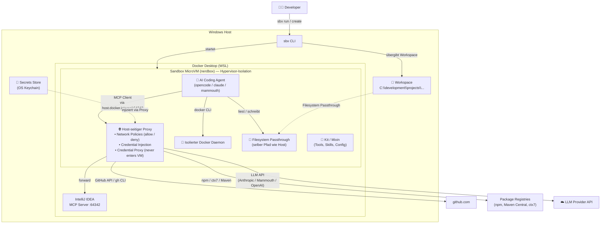

# opencode-sandbox-kit

[](https://github.com/dboeckli/opencode-sandbox-kit/actions/workflows/validate.yml)
[](https://github.com/dboeckli/opencode-sandbox-kit/actions/workflows/e2e.yml)

Docker Sandbox Kit (mixin) for OpenCode / Mammouth Code / Claude Code with ctx7, IntelliJ MCP, Java, Maven, Docker CLI, and kubectl. Enthält zusätzlich ein dediziertes **Mammouth Code Agent-Kit** (`mammouth-agent/`, `kind: sandbox`, entrypoint `mammouth`).

```
┌────────────────────────────────────────────────────────────────────┐
│                         WINDOWS HOST                               │
│                                                                    │
│  ┌────────────────────────────────────────────────────────────┐    │
│  │                    IntelliJ IDEA                           │    │
│  │                                                            │    │
│  │  MCP Server läuft auf http://127.0.0.1:64342/sse           │    │
│  └──────────────────────┬─────────────────────────────────────┘    │
│                         │ Port 64342                               │
│                         ▼                                          │
│  ┌────────────────────────────────────────────────────────────┐    │
│  │              Docker Desktop (WSL)                          │    │
│  │                                                            │    │
│  │  ┌──────────────────────────────────────────────────────┐  │    │
│  │  │         HOST-SEITIGER PROXY                          │  │    │
│  │  │  - Network Policies (allow/deny)                     │  │    │
│  │  │  - Credential Injection (GitHub Token u.a.)          │  │    │
│  │  │  - Forward an IntelliJ MCP, GitHub, npm, etc.        │  │    │
│  │  └──────────┬───────────────────────────────────────────┘  │    │
│  │             │                                              │    │
│  │  host.docker.internal → Windows-Host                       │    │
│  │             │                                              │    │
│  │  ┌──────────────────────────────────────────────────────┐  │    │
│  │  │           SANDBOX (MicroVM / nerdbox)                │  │    │
│  │  │  ┌────────────────────────────────────────────────┐  │  │    │
│  │  │  │    opencode (CLI Agent)                        │  │  │    │
│  │  │  │                                                │  │  │    │
│  │  │  │  MCP Client ───► host.docker.internal:         │  │  │    │
│  │  │  │                 64342/sse ──► Proxy ──► IDEA   │  │  │    │
│  │  │  │                                                │  │  │    │
│  │  │  │  docker (CLI) ───► isolierter Docker Daemon    │  │  │    │
│  │  │  │                   (im MicroVM, nicht Host)     │  │  │    │
│  │  │  │                                                │  │  │    │
│  │  │  │  Filesystem Passthrough                        │  │  │    │
│  │  │  │  C:\dev\projects\... (selber Pfad wie Host)    │  │  │    │
│  │  │  └────────────────────────────────────────────────┘  │  │    │
│  │  │                                                      │  │    │
│  │  │  isolation: Hypervisor (KVM) + Namespaces + Proxy    │  │    │
│  │  └──────────────────────────────────────────────────────┘  │    │
│  │                                                            │    │
│  └────────────────────────────────────────────────────────────┘    │
│                                                                    │
│  📁 C:\development\projects\ ← direkt via Filesystem Passthrough   │
│                                                                    │
└────────────────────────────────────────────────────────────────────┘
```

## Architektur



### Docker CLI in der Sandbox

Das Kit installiert die Docker CLI (statisches Binary). Jede Sandbox hat einen **isolierten Docker Daemon**
im eigenen MicroVM – kein Host-Socket-Mount nötig. Docker-Befehle funktionieren direkt.

> Der Docker Socket kann nur beim **Erstellen** der Sandbox gemountet werden, nicht nachträglich.

### Netzwerk: Deny-by-Default mit Allow-Liste

Die Sandbox hat eine **Allow-Liste** für ausgehende Verbindungen (`permissions.network.allow`) — nur gelistete
Domains sind erreichbar, alles andere wird geblockt (HTTP 403, `default-deny`). Requests zu nicht-whitelisted
Hosts werden zwar von den Agent-Tools versucht, kommen aber nie nach außen.

**Wie sie durchgesetzt wird:** Erzwungen wird die Liste nicht vom Kit, sondern von der Sandbox selbst — über den
**Sandbox-Proxy** (`mcp-gateway`, erreichbar als `mcp-gateway.docker.internal`). Er ist der einzige
Netzwerk-Ausgang der Sandbox und blockt jeden Request an nicht-whitelisted Hosts mit HTTP 403 — der Request
verlässt die Sandbox nie. Derselbe Proxy übernimmt auch die **Credential-Injection**: Er tauscht den
`proxy-managed`-Platzhalter transparent gegen die echten API-Keys (z. B. Context7/DeepSeek) — der Key liegt nie
im Filesystem. Der `mcp-gateway`-Eintrag in der MCP-Liste des Agents (z. B. „mcp-gateway Connected“ in OpenCode)
ist genau dieser Proxy: kein Fehler und kein Kit-Bestandteil, sondern Template-Infrastruktur der Sandbox
(`docker/sandbox-templates:opencode-docker` trägt ihn automatisch in die Agent-Config ein).

**`network-policy.md` ist rein informativ:** Die Allow-Liste ist zusätzlich in den Agent-Instructions
dokumentiert (`~/.config/opencode/network-policy.md`, `~/.claude/network-policy.md`, im Agent-Kit
`~/.config/mammouth/...`), damit der Agent geblockte Calls von vornherein vermeidet (Token-Kosten) — erzwingen
tut sie nichts. Das Enforcement passiert ausschließlich am Sandbox-Proxy. Beim Anpassen der Liste in
`spec.yaml` muss diese Dokumentation synchron gehalten werden.

## Dual Agent Support

Das Kit funktioniert mit **OpenCode, Claude Code und Mammouth Code** – der Agent wird nicht vom Kit bestimmt,
sondern vom Template beim `sbx run`:

| Agent | Template | Start-Command |
|-------|----------|---------------|
| OpenCode | `opencode-docker` | `sbx run opencode --name my-sandbox --kit .` |
| Claude Code | `claude-code-docker` | `sbx run claude --name my-sandbox --kit .` |
| Mammouth Code | `opencode-docker` (eigenes Agent-Kit `mammouth-agent/`) | `sbx run mammouth --name mammouth-sandbox --kit ./mammouth-agent/` |

Alle drei erhalten dieselben Tools (JDK, Maven, Docker CLI, Skills, ctx7) und den IntelliJ MCP via
`host.docker.internal:64342`. Die jeweilige Konfiguration wird automatisch gelesen:

- **OpenCode**: `~/.config/opencode/opencode.jsonc` + `~/.config/opencode/AGENTS.md` — Modell `opencode/deepseek-v4-flash-free`
- **Claude Code**: `~/.claude/settings.json` + `~/.claude/CLAUDE.md`
- **Mammouth Code**: `~/.config/mammouth/opencode.jsonc` + `~/.config/mammouth/AGENTS.md`

### Mammouth Code Agent-Kit

[Mammouth Code](https://info.mammouth.ai/docs/mammouth-code/) ist ein Open-Source-Fork von OpenCode.
Da `sbx` keinen eingebauten `mammouth`-Agenten kennt, liegt unter `mammouth-agent/` ein **eigenes
Sandbox-Kit** (`kind: sandbox`, Name `mammouth`) – analog zum Amp-Beispiel aus der Docker-Doku:

- **Base-Image**: `docker/sandbox-templates:opencode-docker` (Mammouth ist ein OpenCode-Fork)
- **Entrypoint**: `mammouth` (direkt, ohne Template-Umweg)
- **Auth**: `credentials[].apiKey` für `api.mammouth.ai` (`name: MAMMOUTH_API_KEY`, `proxyManaged: true`,
  `inject` als `Authorization: Bearer`) — kit-spec v2
- **Tools**: installiert dieselben Tools wie das Mixin-Kit (JDK, Maven, Docker CLI, kubectl, ctx7, Skills)
- **Config**: `~/.config/mammouth/opencode.jsonc` + `~/.config/mammouth/AGENTS.md`

Die Konfiguration liegt unter `~/.config/mammouth/` (XDG-app `mammouth`):

- **Modell**: `opencode/deepseek-v4-flash-free` (DeepSeek V4 Flash Free) als Default
- **IntelliJ MCP**: SSE-Endpoint `http://host.docker.internal:64342/sse`
- **Plugins**: Startup-Checks + Auto-Session (identisch zu OpenCode, da Fork)
- **PATH**: `mammouth`-Binary via Symlink `/usr/local/bin/mammouth` aufgelöst; `JAVA_HOME` via Kit-`environment.variables` (v2)

**Installation** — das Agent-Kit installiert Mammouth automatisch beim Sandbox-Build
(`curl -fsSL https://code.mammouth.ai/install.sh | bash` als User 1000) und legt einen Symlink
`/usr/local/bin/mammouth` an, damit der Entrypoint den Agenten findet. Manuell nur nötig, wenn die
Sandbox bereits läuft:

```bash
curl -fsSL https://code.mammouth.ai/install.sh | bash
```

**Update/Uninstall:** `mammouth upgrade` bzw. `mammouth uninstall`.

**Auth** — API-Key wird als Env-Variable `MAMMOUTH_API_KEY` erwartet (Provider `mammouth-ai` mit Base-URL
`https://api.mammouth.ai/v1`). Der Key stammt aus https://mammouth.ai/app/account/settings/api.

**Secret setzen** — es gibt keinen eingebauten Provider wie bei `anthropic`/`github`. Das Agent-Kit deklariert
den Service `mammouth` (`credentials[].apiKey` mit `name: MAMMOUTH_API_KEY`). Den Key als Secret registrieren,
damit der Proxy ihn für Requests an `api.mammouth.ai` als `MAMMOUTH_API_KEY` injiziert — der Key liegt nie im
Sandbox-Filesystem:

```powershell
# Kit-deklarierter Service (wie sbx secret set anthropic)
sbx secret set mammouth
```

> **Wichtig:** `MAMMOUTH_API_KEY` ist in der Sandbox auf den Platzhalter `proxy-managed` gesetzt — genau wie
> bei Claude Code. Das Agent-Kit setzt sie via `credentials[].apiKey.name` + `proxyManaged: true`; der
> Proxy ersetzt den Platzhalter transparent bei Outbound-Requests an `api.mammouth.ai`. Das ist gewollt,
> kein Fehler. `env | grep MAMMOUTH` zeigt `MAMMOUTH_API_KEY=proxy-managed` (nie den echten Key).

**Verifikation:**

```powershell
# 1. Secret ist registriert
sbx secret ls

# 2. Test-Call aus der Sandbox (Key wird vom Proxy injiziert)
sbx exec mammouth-sandbox bash -c 'curl -s https://api.mammouth.ai/v1/models -H "Authorization: Bearer $MAMMOUTH_API_KEY" | head'
```

### Claude Code Konfiguration

`~/.claude/settings.json` enthält:

- **Modell**: `claude-sonnet-4-6` als Default (`"model"`). Zusätzlich per Env-Variablen abgesichert
  (`ANTHROPIC_DEFAULT_SONNET_MODEL` + `ANTHROPIC_MODEL` via Kit-`environment.variables`), damit das Template
  die settings.json nicht mit einem Default-Modell (Opus 5) überschreiben kann.
- **IntelliJ MCP**: SSE-Endpoint `http://host.docker.internal:64342/sse`
- **StatusLine**: `bash ~/.claude/statusline.sh` – zeigt Modell, Kontext-Tokens, Kosten, geänderte Zeilen und Session-Dauer
- **SessionStart-Hook**: führt die Sandbox-Checks aus und übergibt den Report als System-Message
  (StatusLine + Hooks liegen in `managed-settings.json` unter `/etc/claude-code/` – höchste Precedence,
  Template-sicher, kein Settings-Race beim Start, siehe `session-start-hook-fix.md`)
- **Permission-Whitelist + Run-Config-Guard**: siehe Abschnitt "IntelliJ MCP Zugriff einschränken"

> **Hinweis:** Das claude-code-docker-Template überschreibt `~/.claude/settings.json` beim Start (u.a. mit
> `apiKeyHelper: echo proxy-managed`, `defaultMode: bypassPermissions`). Das Modell wird deshalb nicht nur in
> der settings.json gesetzt, sondern zusätzlich fest über die Env-Variablen erzwungen. Nach Änderungen am
> Kit die Sandbox neu erstellen (bzw. `sbx kit add`), damit die Env-Variablen greifen.

Die StatusLine (`~/.claude/statusline.sh`) wird beim Sandbox-Build aus
[dboeckli/ai-agent-skills](https://github.com/dboeckli/ai-agent-skills) installiert.

## Voraussetzungen (Prerequisites)

Bevor du das Kit verwenden kannst, brauchst du auf dem Windows-Host:

| Voraussetzung | Beschreibung | Benötigt für |
|---------------|--------------|--------------|
| **Docker Desktop** (Windows) | Laufender Docker Daemon — native Windows-Installation **oder** Ubuntu-WSL-Setup (Laufzeitumgebung dort: **Ubuntu 16.04**) | Sandbox-Ausführung |
| **`sbx` CLI** | Docker Sandbox CLI, `sbx` im PATH | Sandbox erstellen / verwalten |
| **KVM-Zugriff (WSL2)** | Zugriff auf `/dev/kvm` für die MicroVM (nerdbox) | Sandbox-VM starten |
| **IntelliJ IDEA** | MCP-Server-Plugin auf `127.0.0.1:64342/sse` | IntelliJ MCP (optional) |
| **API-Keys / Secrets** | globale Secrets, vom Proxy verwaltet — liegen nie im Sandbox-Filesystem | je nach Agent (siehe unten) |

> **WSL als Alternative:** Standard ist Windows PowerShell + Docker Desktop. Das Kit läuft aber auch aus einem
> **Ubuntu-WSL-Setup** heraus (Laufzeitumgebung dort: **Ubuntu 16.04**). `sbx run` / `sbx exec`
> und der IntelliJ-MCP-Zugriff über `host.docker.internal:64342` funktionieren dort genauso — inkl.
> Secret-Injection (gh/ctx7) und Network-Allow-List.

### IntelliJ MCP Server aktivieren

Damit der Agent die IntelliJ-MCP-Tools (`idea_*`) nutzen kann, muss auf dem Windows-Host die IDE als
MCP-Server laufen:

1. **IntelliJ IDEA 2025.2 oder neuer** installieren — seit 2025.2 ist ein MCP-Server in der IDE integriert.
2. **MCP Server Plugin aktivieren**: Das Plugin ist gebündelt und standardmäßig aktiviert. Falls
   `idea_*`-Tools nicht verfügbar sind, den Plugin-Status unter **Settings → Plugins** prüfen
   (`MCP Server` muss aktiviert sein).
3. **IDE laufen lassen** und das Projekt öffnen — der MCP-Server lauscht auf `127.0.0.1:64342/sse`.
4. **Port 64342 in der Windows-Firewall freigeben** (nötig für den Zugriff aus der Sandbox über
   `host.docker.internal:64342`).

> Optional (z. B. für weitere MCP-Server im Kit): unter **Settings → Tools → MCP Server** die SSE-URL
> `http://127.0.0.1:64342/sse` als Server registrieren. Für die Kit-Nutzung ist das nicht nötig — die
> Konfiguration liegt bereits in `opencode.jsonc` / `settings.json`.

### IntelliJ MCP Zugriff einschränken (Whitelist + Run-Config-Guard)

Für **OpenCode (Mixin-Kit), Claude Code und Mammouth Code (Agent-Kit)** ist der Zugriff auf die `idea_*`-Tools
per **Whitelist** geregelt (Deny-by-Default, nur lesende Operationen erlaubt). Die Config liegt je
Agent-Location vor:

**OpenCode / Mammouth** (Mammouth ist ein OpenCode-Fork und nutzt dieselben `permission`-Regeln und
Plugin-Hooks) — unter `~/.config/opencode/opencode.jsonc` und `~/.config/mammouth/opencode.jsonc`
(nur Agent-Kit):

- `"idea_*": "deny"` zuerst, danach gezielte `allow`-Regeln. **Reihenfolge zählt**: opencode wertet die letzte
  passende Rule aus (`findLast`), deshalb Deny vor Allows.
- **Erlaubt (nur lesend)**: `idea_get_*`, `idea_list_*`, `idea_search_*`, `idea_read*`, `idea_generate_*`,
  `idea_xdebug_get_*`, `idea_xdebug_list_*` sowie einzeln `idea_analyze_calls`, `idea_git_status`,
  `idea_lint_files`, `idea_skill_search`, `idea_fetch_query_result`, `idea_preview_table_data`,
  `idea_test_database_connection`, `idea_introspect_schema`, `idea_run_inspection_kts`,
  `idea_validate_inspection_kts`.
- **`ask`**: `idea_execute_run_configuration` — nur mit Bestätigung und nur für die im Run-Config-Guard
  erlaubte Config.
- **Versteckt (deny)**: alle schreibenden/ausführenden Tools (`idea_apply_patch`, `idea_execute_terminal_command`,
  `idea_execute_tool`, `idea_open_file_in_editor`, `idea_reformat_file`, `idea_rename_refactoring`,
  `idea_build_project`, `idea_notebookEdit`, `idea_xdebug_set_*`, `idea_xdebug_run_to_line`,
  `idea_xdebug_control_session`, `idea_xdebug_start_debugger_session`, DB-Connection-Änderungen, ...) — sie
  tauchen gar nicht erst in der Tool-Liste auf.

**Claude Code** — `~/.claude/settings.json` (`permissions`-Block): kein Deny-by-Default-Wildcard wie bei
OpenCode (Claude wertet `deny` vor `allow` aus, ein breites `mcp__idea__*`-Deny würde alle Allows
überdecken). Stattdessen eine explizite **`allow`-Whitelist** der nur-lesenden MCP-Tools als
`mcp__idea__<tool>` (analog zur OpenCode-Allowlist), eine **`deny`-Blocklist** für die
schreibenden/ausführenden Tools. Nicht gelistete MCP-Tools fallen auf den Standard-Prompt zurück.
`idea_execute_run_configuration` ist nicht in `allow` — der PreToolUse-Guard trifft die Entscheidung.

**Run-Config-Guard**: MCP-Tools reporten dem Permission-System immer
`resource: "*"` (nie die Tool-Inputs), deshalb kann `idea_execute_run_configuration` nicht per reiner
`permission`-Config auf einzelne Run-Configs begrenzt werden.
- OpenCode/Mammouth (`~/.config/opencode/plugins/intellij-run-config-guard.js` und
  `~/.config/mammouth/plugins/intellij-run-config-guard.js` im Agent-Kit): Plugin-Hook `tool.execute.before`
  liest `configurationName` und erlaubt ausschließlich `local-test-kits-validate-only` — jede andere Config
  wirft einen Fehler.
- Claude Code (`~/.config/sandbox-kit/intellij-run-config-guard.sh`): PreToolUse-Hook gematcht auf
  `mcp__idea__execute_run_configuration`. Liest `tool_input.configurationName`; erlaubt
  `local-test-kits-validate-only` (exit 0), blockt alles andere (`permissionDecision: deny`, exit 2). Andere
  MCP-Tools passieren den Hook unverändert.

> Config und Plugins werden beim Start geladen (kein Hot-Reload) — nach Änderungen opencode/mammouth/claude neu starten.

### API-Keys / Secrets

> **`sbx secret` (v0.38+):** Das `-g`-Flag bei `sbx secret set` ist entfernt — Service-Secrets sind standardmäßig
> **global**, der Service ist ein Positionsargument (`sbx secret set github`). Mit `--sandbox <name>` scopen.
> Kit-deklarierte Services (context7/deepseek/mammouth) funktionieren identisch. Third-Party-v2-Kits brauchen
> zusätzlich pro Service ein **Credential-Binding** (`%APPDATA%\sbx\credentials.yaml`; beim ersten Lauf interaktiv).

| Service | Secret | Befehl | Benötigt für |
|---------|--------|--------|--------------|
| GitHub | persönliches Token (`opencode-sandbox-kit-github-token`) | `sbx secret set github -t "<token>"` | `gh` CLI |
| Anthropic | Anthropic API-Key | `sbx secret set anthropic` | Claude Code |
| Mammouth | Mammouth API-Key | `sbx secret set mammouth` | Mammouth Code |
| DeepSeek | DeepSeek API-Key | `sbx secret set deepseek` | OpenCode (optional, Modell `deepseek/…`) |
| Context7 | Context7 API-Key (optional) | `sbx secret set context7` | ctx7 (höheres Rate-Limit) |

Für den e2e-Test in GitHub Actions werden zusätzlich `DOCKER_USERNAME` (Repo-Variable) und
`DOCKER_PAT` (Secret) benötigt.

> Die GitHub-Actions-Pipelines (`validate.yml`, `e2e.yml`) installieren eine **gepinnte `sbx`-Version**
> (`SBX_VERSION`-Env, aktuell `v0.38.0`) statt `latest`. Updates übernimmt
> Renovate (`customManager` für `docker/sbx-releases`, `github-releases`-Datasource).

Detaillierte Anleitungen:
- [GitHub Authentication](#github-authentication)
- [Anthropic Authentication](#anthropic-authentication)
- [Mammouth Code Agent-Kit](#mammouth-code-agent-kit)
- [Context7 API-Key (optional)](#context7-api-key-optional)

## Usage (PowerShell on Windows)

```powershell
# Lokales Kit (Entwicklung)
sbx run opencode --name opencode-sandbox --kit .          # OpenCode
sbx run claude   --name claude-sandbox   --kit .          # Claude Code
sbx run mammouth --name mammouth-sandbox --kit ./mammouth-agent/   # Mammouth Code (eigenes Agent-Kit)

# Kit direkt aus GitHub (ohne Clone)
sbx settings set kit.allowedSources --% "[\"docker.io/\",\"github.com/dboeckli/\"]"
sbx run opencode --name opencode-sandbox --kit "git+https://github.com/dboeckli/opencode-sandbox-kit.git"
sbx run claude   --name claude-sandbox   --kit "git+https://github.com/dboeckli/opencode-sandbox-kit.git"
sbx run mammouth --name mammouth-sandbox --kit "git+https://github.com/dboeckli/opencode-sandbox-kit.git#dir=mammouth-agent"

# Kit mit anderem Projekt verwenden
sbx run opencode --name spring-6-reactive --kit "git+https://github.com/dboeckli/opencode-sandbox-kit.git" "C:\development\projects\spring-6-reactive"
sbx run claude   --name spring-6-reactive --kit "git+https://github.com/dboeckli/opencode-sandbox-kit.git" "C:\development\projects\spring-6-reactive"
sbx run mammouth --name mammouth-sandbox --kit "git+https://github.com/dboeckli/opencode-sandbox-kit.git#dir=mammouth-agent" "C:\development\projects\spring-6-reactive"

# Kit auf bestehende Sandbox anwenden (restartet Sandbox, VM-State bleibt)
sbx kit add spring-6-reactive "git+https://github.com/dboeckli/opencode-sandbox-kit.git"
```

The sandbox runs inside Docker Desktop. IntelliJ MCP is reached via `host.docker.internal:64342`.

## Automatisierter Kit-Test

Die 3 Agent-Szenarien (OpenCode, Claude, Mammouth) lassen sich lokal automatisiert testen —
`local-test-kits.py` (cross-platform, Windows + Linux/macOS) validiert alle drei Kits, prüft die
Secrets, baut pro Szenario eine Sandbox, prüft Tools/Config/Startup-Checks und räumt danach auf:

```bash
python local-test/local-test-kits.py            # ohne --keep: Sandboxes werden wieder entfernt
python local-test/local-test-kits.py --keep     # Sandboxes nach dem Test behalten
python local-test/local-test-kits.py --validate-only   # nur Kit-Validierung, keine Sandboxes
```

Lokales Testen in **Windows PowerShell** (Docker Desktop nativ):

```powershell
python .\local-test\local-test-kits.py          # ohne --keep: Sandboxes werden wieder entfernt
python .\local-test\local-test-kits.py --keep   # Sandboxes nach dem Test behalten
python .\local-test\local-test-kits.py --validate-only   # nur Kit-Validierung, keine Sandboxes
```

Voraussetzungen: Docker läuft (auf Windows nativ oder im Ubuntu-WSL-Setup), `sbx` im PATH,
globale Secrets gesetzt (`github`, `anthropic`, `mammouth`, `context7`).

## Startup Checks

Beim Start jeder Session prüft das Kit automatisch die Tooling-Verfügbarkeit
(Context7, IntelliJ MCP, gh, Java/Maven, Docker, kubectl, Skills) und zeigt den Report als
`[startup-checks] ...` an:

```
[startup-checks] ctx7:OK intellij-mcp:OK gh:OK java/maven:OK docker:OK kubectl:OK skills:OK
```

- **OpenCode**: Ein Server-Plugin führt die Checks sofort beim Start aus, injiziert den Report in den
  System-Prompt und schreibt ihn nach `~/.config/sandbox-kit/startup-checks.report`. Ein TUI-Plugin
  (Auto-Session) startet direkt im Session-View, sodass die Sidebar mit den Blöcken **Startup checks**
  und **Skills** sofort sichtbar ist – ohne ersten Prompt.
- **Claude Code**: Ein `SessionStart`-Hook übergibt den Report als System-Message (registriert in `managed-settings.json` unter `/etc/claude-code/`).
- **Mammouth Code** (Agent-Kit): Da Fork von OpenCode, werden dieselben Server-/TUI-Plugins aus `~/.config/mammouth/plugins/` geladen.
- **Manuell**: `bash ~/.config/sandbox-kit/run-checks.sh`
- **Referenz**: `~/.config/sandbox-kit/startup-checks.md`

Der Agent bestätigt den Status in der ersten Antwort und schlägt bei einem `FAIL` einen Fix vor.

## Installierte Tools

| Tool | Version | Installiert in |
|------|---------|---------------|
| Liberica JDK | 25.0.4 | `/usr/local/java` |
| Apache Maven | 3.9.16 | `/opt/maven` |
| Docker CLI | 27.5.1 | `/usr/local/bin/docker` |
| Docker Compose | 5.4.0 (Plugin) | `/usr/local/lib/docker/cli-plugins/docker-compose` |
| kubectl | latest stable | `/usr/local/bin/kubectl` |
| Helm | 3.21.3 (v3) | `/usr/local/bin/helm` |
| ctx7 | latest | npm global |
| skills | 1.5.21 | npm global (vercel-labs) |
| renovate | latest | npm global |
| jq | distro | apt (StatusLine-Abhängigkeit) |

`JAVA_HOME` wird via Kit-`environment.variables` in jeder Shell verfügbar gemacht (Java/Maven liegen über
Symlinks bereits in `/usr/local/bin` und damit auf dem PATH).

> **Warum Helm v3 und nicht v4?** `kokuwaio/helm-maven-plugin` (io.kokuwa.maven, derzeit 6.17.0) ist **nicht mit Helm v4 kompatibel** (offenes Issue [#427](https://github.com/kokuwaio/helm-maven-plugin/issues/427)): Das `registry-login`-Goal übergibt die volle Registry-URL an `helm registry login` — v3 gab dafür nur eine Warnung, **v4 bricht mit `invalid reference: invalid registry` ab**. Das betrifft den `helm push`/Upload (z. B. im spring-6-reactive-Build). Ein Fix-Release existiert noch nicht (nur 6.17.1-SNAPSHOT auf master). Daher pinnt das Kit Helm auf 3.21.3. Ohne Pin würde das Plugin selbst das "latest" Release ziehen (aktuell v4) — bei `useLocalHelmBinary=true` greift die Sandbox-Helm-Version.

### Context7 API-Key (optional)

Für höheres Rate-Limit kann ein Context7 API-Key verwendet werden (https://context7.com/dashboard).
Das Kit deklariert den Service `context7` (`credentials[].apiKey` mit `name: CONTEXT7_API_KEY`,
`proxyManaged: true`). Den Key als Secret registrieren, damit der Proxy ihn für Requests an
`context7.com` als `Authorization: Bearer` injiziert — der Key liegt nie im Sandbox-Filesystem:

```powershell
# Kit-deklarierter Service (wie sbx secret set mammouth)
sbx secret set context7
```

> **Wichtig:** `CONTEXT7_API_KEY` ist in der Sandbox auf den Platzhalter `proxy-managed` gesetzt.
> Die ctx7-CLI liest die Variable und sendet `Authorization: Bearer proxy-managed`; der Proxy
> ersetzt den Platzhalter transparent bei Outbound-Requests an `context7.com`. Das ist gewollt,
> kein Fehler. `echo $CONTEXT7_API_KEY` zeigt `proxy-managed` (nie den echten Key).

Verifikation (identisch zur Prüfung im automatisierten Test `local-test-kits.py` — ohne Live-API-Call):

```powershell
# 1. Secret ist registriert
sbx secret ls

# 2. In der Sandbox: Platzhalter sichtbar (nie der echte Key) — das ist die Verifikation
sbx exec opencode-sandbox bash -c 'echo $CONTEXT7_API_KEY'   # → proxy-managed
```

Der automatisierte Test prüft bewusst nur den Platzhalter (`echo $CONTEXT7_API_KEY` → `proxy-managed`),
keinen echten Request an `context7.com` — damit läuft er auch im CI mit Fake-Keys.
Ein manueller Live-Call (Key wird dann vom Proxy injiziert) ist optional möglich:

```powershell
sbx exec opencode-sandbox bash -c 'npx ctx7 docs /vercel/next.js "app router"'
```

## Skills

Das Kit installiert automatisch Skills aus [dboeckli/ai-agent-skills](https://github.com/dboeckli/ai-agent-skills) via `skills add -g --all`. Installierte Skills:

- **camel-matrix** — Camel Spring Boot Kompatibilitätsmatrix
- **cc-best-practices** — Claude Code Best Practices
- **project-references** — Referenzprojekt-Suche
- **skill-best-practices** — SKILL.md Schreib-Guide

Skills landen in `~/.agents/skills/` (werden als `user: "1000"` installiert).

## GitHub Authentication

Für `gh` CLI in der Sandbox ein persönliches GitHub-Token (Name: `opencode-sandbox-kit-github-token`) mit den
Scopes `read:org`, `read:packages`, `read:project`, `read:user` erstellen und als Secret speichern:

```powershell
sbx secret set github -t "<github-token>"
```

Das Token wird via Proxy automatisch injiziert – `gh auth status` funktioniert ohne weitere Konfiguration.

> **Hinweis:** Für Private-Repo-Zugriff, Push oder PR/Issue-Erstellung wird zusätzlich das `repo`-Scope
> benötigt. Dies kann via `gh auth refresh -h github.com -s repo` nachgefordert werden.

## Anthropic Authentication

Für Claude Code in der Sandbox wird der Anthropic API-Key als Secret gespeichert und vom Proxy verwaltet – der Key liegt nie im Sandbox-Filesystem:

```powershell
sbx secret set anthropic
```

Es wird davon ausgegangen, dass `ANTHROPIC_API_KEY` nicht als Env-Variable gesetzt ist – der Key wird interaktiv eingegeben. Falls bereits ein OAuth-Token existiert, wird nachgefragt – mit `-f` überschreiben:

```powershell
sbx secret set anthropic -f
```

Verifikation:

```powershell
sbx secret ls   # sollte "anthropic (stored)" zeigen
```

In der Sandbox sollte `env | grep -i ANTHROPIC` leer sein, während API-Calls über den Proxy trotzdem funktionieren.

## Troubleshooting

### KVM Permission Denied (WSL2)

On WSL2, the sandbox VM (`nerdbox`) needs access to `/dev/kvm`. If you see:
```
failed to create VM: sailor: Hypervisor error: KVM error: Permission denied
```

```console
# Add user to groups
sudo usermod -aG kvm $USER
sudo usermod -aG sgx $USER

# Fix /dev/kvm group ownership
sudo chgrp kvm /dev/kvm

# Restart the sandbox daemon to pick up group changes
sbx daemon stop
sbx daemon start --detach
```

### Remove a sandbox

```powershell
sbx rm opencode-sandbox --force
```

### IntelliJ MCP connection failed (WSL2 / Docker)

Der IntelliJ MCP-Forwarder läuft auf Windows unter `127.0.0.1:64342`.

**Via `host.docker.internal` (Standard, funktioniert mit Docker Desktop unter Windows):**  
Im Sandbox-Kit ist die MCP-URL auf `host.docker.internal:64342` konfiguriert. Docker Desktop löst
diese Adresse automatisch auf den Windows-Host auf (inkl. Loopback). Funktioniert auch ohne WSL
`networkingMode=mirrored`.

> **Wichtig:** Aus dem Container heraus ist `127.0.0.1`/`localhost` der Loopback des Containers selbst,
> nicht der Host. Die MCP-URL darf daher **nicht** auf `127.0.0.1` geändert werden — das funktioniert
> nur, wenn der Agent direkt in WSL läuft (ohne Container).

**Manuelle Verifikation vom Host** (PowerShell oder WSL):

```bash
sbx exec opencode-sandbox bash -c 'curl -s -o /dev/null -w "HTTP %{http_code}\n" -m 3 http://host.docker.internal:64342/sse'
```

Erwartet: `HTTP 200` (das SSE-Endpoint hält die Verbindung offen — `-m 3` beendet curl nach 3s;
nur der HTTP-Code zählt, ein `FEHLER`-Exit ist dabei normal).

Falls `host.docker.internal` nicht verfügbar sein sollte (z. B. Docker Engine ohne Docker Desktop):
den MCP-Server im IntelliJ-Plugin auf `0.0.0.0` binden lassen und die Windows-Host-IP verwenden.
Stelle zudem sicher, dass Port 64342 in der Windows-Firewall freigegeben ist.

## Caveats

### Kit-Spec v2 und die sbx-Version

Beide Kits (Mixin und `mammouth-agent/`) sind auf die **v2-Kit-Grammatik** migriert:
`schemaVersion: "2"`, `permissions.network.allow`, `credentials[].apiKey` (`apiKey.name` + `inject`),
`setup.install` und `setup.startup`, Top-Level `environment.variables`, `agentInstructions` sowie flacher
`sandbox.entrypoint`. Die Migration verlangt **sbx v0.38+** (strikte v2-Grammatik mit hartem
Decode-Fehler für v1-Felder in einer `"2"`-Spec). Validierung:

```bash
sbx kit validate .                 # und: sbx kit validate ./mammouth-agent
sbx kit inspect . --output json | jq '.warnings'   # erwartet: [] bzw. null
```

Migration auf das offizielle Skript aus `docker/sbx-kits-contrib`:

```bash
git clone --depth 1 https://github.com/docker/sbx-kits-contrib.git
go run scripts/migrate-v1-to-v2.go <kit-dir>
```

Offizielle v2-Referenz: https://github.com/docker/sbx-kits-contrib/blob/main/spec/SPEC-v2.md
(enthalten im `sbx-kits-contrib`-Repo; nicht in Context7, `docker/docs` dokumentiert noch v1).

### Mammouth Code wird ausschließlich über das Agent-Kit betrieben

Mammouth Code wird über das **dedizierte Agent-Kit** (`mammouth-agent/`,
`sbx run mammouth --name mammouth-sandbox --kit ./mammouth-agent/`) betrieben, das Mammouth automatisch
beim Build installiert (`curl -fsSL https://code.mammouth.ai/install.sh | bash` + Symlink). Das Mixin-Kit
(`sbx run opencode/claude --kit .`) ist bewusst auf OpenCode und Claude Code fokussiert und enthält keine
Mammouth-Konfiguration.

### Pre-installed Tools im Base Image

Das Sandbox Base-Image (`docker/sandbox-templates:opencode-docker`) enthält eine eigene OpenCode CLI
(aktuell `1.17.11` in der Sandbox). Das Kit überschreibt diese Version **nicht**. OpenCode ist inzwischen
bei `1.18.11` – falls nach dem Kit-Build eine ältere Version angezeigt wird, liegt das an der
vorinstallierten Version im Base-Image. Zum Aktualisieren in der Sandbox:

```
npm install -g @opencode-ai/cli
```

### Skills landen nicht bei `agent`

Falls Skills in der Sandbox nicht sichtbar sind (`ls ~/.agents/skills/` leer), liegt es meist daran,
dass der `skills add`-Befehl als `root` statt als `agent` lief. Im Kit ist `user: "1000"` gesetzt –
beim Test muss die Sandbox neu erstellt werden (`sbx template rm ...` + `sbx run ...`).

## References

- [GitHub Repo](https://github.com/dboeckli/opencode-sandbox-kit)
- [Docker Sandbox Kits](https://docs.docker.com/ai/sandboxes/customize/kits/)
- [Kit Spec Reference](https://docs.docker.com/ai/sandboxes/customize/kit-reference/)
- [Docker Blog — AI Coding Agent Horror Stories: Security Risks](https://www.docker.com/blog/ai-coding-agent-horror-stories-security-risks/)
