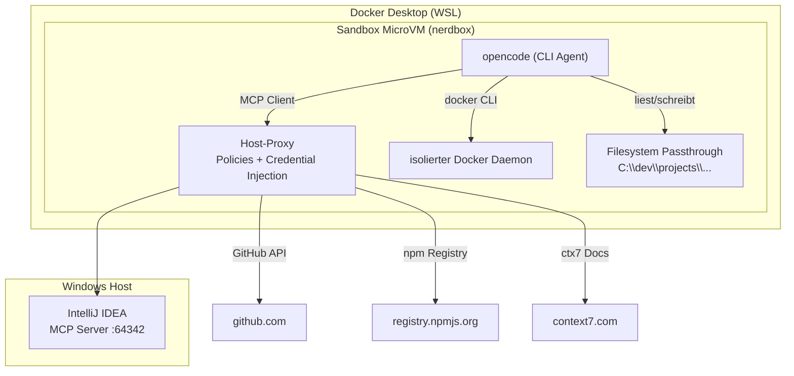

# opencode-sandbox-kit

[](https://github.com/dboeckli/opencode-sandbox-kit/actions/workflows/validate.yml)
[](https://github.com/dboeckli/opencode-sandbox-kit/actions/workflows/e2e.yml)

Docker Sandbox Kit (mixin) for OpenCode / Mammouth Code / Claude Code with ctx7, IntelliJ MCP, Java, Maven, Docker CLI, and kubectl. Enthält zusätzlich ein dediziertes **Mammouth Code Agent-Kit** (`mammouth-agent/`, `kind: sandbox`).

```
┌────────────────────────────────────────────────────────────────────┐
│                         WINDOWS HOST                               │
│                                                                    │
│  ┌────────────────────────────────────────────────────────────┐    │
│  │                    IntelliJ IDEA                           │    │
│  │                                                            │    │
│  │  MCP Server läuft auf http://127.0.0.1:64342/sse           │    │
│  └──────────────────────┬─────────────────────────────────────┘    │
│                         │ Port 64342                               │
│                         ▼                                          │
│  ┌────────────────────────────────────────────────────────────┐    │
│  │              Docker Desktop (WSL)                          │    │
│  │                                                            │    │
│  │  ┌──────────────────────────────────────────────────────┐  │    │
│  │  │         HOST-SEITIGER PROXY                          │  │    │
│  │  │  - Network Policies (allow/deny)                     │  │    │
│  │  │  - Credential Injection (GitHub Token u.a.)          │  │    │
│  │  │  - Forward an IntelliJ MCP, GitHub, npm, etc.        │  │    │
│  │  └──────────┬───────────────────────────────────────────┘  │    │
│  │             │                                              │    │
│  │  host.docker.internal → Windows-Host                       │    │
│  │             │                                              │    │
│  │  ┌──────────────────────────────────────────────────────┐  │    │
│  │  │           SANDBOX (MicroVM / nerdbox)                │  │    │
│  │  │  ┌────────────────────────────────────────────────┐  │  │    │
│  │  │  │    opencode (CLI Agent)                        │  │  │    │
│  │  │  │                                                │  │  │    │
│  │  │  │  MCP Client ───► host.docker.internal:         │  │  │    │
│  │  │  │                 64342/sse ──► Proxy ──► IDEA   │  │  │    │
│  │  │  │                                                │  │  │    │
│  │  │  │  docker (CLI) ───► isolierter Docker Daemon    │  │  │    │
│  │  │  │                   (im MicroVM, nicht Host)     │  │  │    │
│  │  │  │                                                │  │  │    │
│  │  │  │  Filesystem Passthrough                        │  │  │    │
│  │  │  │  C:\dev\projects\... (selber Pfad wie Host)    │  │  │    │
│  │  │  └────────────────────────────────────────────────┘  │  │    │
│  │  │                                                      │  │    │
│  │  │  isolation: Hypervisor (KVM) + Namespaces + Proxy    │  │    │
│  │  └──────────────────────────────────────────────────────┘  │    │
│  │                                                            │    │
│  └────────────────────────────────────────────────────────────┘    │
│                                                                    │
│  📁 C:\development\projects\ ← direkt via Filesystem Passthrough   │
│                                                                    │
└────────────────────────────────────────────────────────────────────┘
```

## Usage (PowerShell on Windows)

```powershell
# Lokales Kit (Entwicklung)
sbx run opencode --name opencode-sandbox --kit .          # OpenCode
sbx run claude   --name claude-sandbox   --kit .          # Claude Code
sbx run mammouth --name mammouth-sandbox --kit ./mammouth-agent/   # Mammouth Code (eigenes Agent-Kit)

# Kit direkt aus GitHub (ohne Clone)
sbx settings set kit.allowedSources --% "[\"docker.io/\",\"github.com/dboeckli/\"]"
sbx run opencode --name opencode-sandbox --kit "git+https://github.com/dboeckli/opencode-sandbox-kit.git"
sbx run claude   --name claude-sandbox   --kit "git+https://github.com/dboeckli/opencode-sandbox-kit.git"
sbx run mammouth --name mammouth-sandbox --kit "git+https://github.com/dboeckli/opencode-sandbox-kit.git#dir=mammouth-agent"

# Kit mit anderem Projekt verwenden
sbx run opencode --name spring-6-reactive --kit "git+https://github.com/dboeckli/opencode-sandbox-kit.git" "C:\development\projects\spring-6-reactive"
sbx run claude   --name spring-6-reactive --kit "git+https://github.com/dboeckli/opencode-sandbox-kit.git" "C:\development\projects\spring-6-reactive"
sbx run mammouth --name mammouth-sandbox --kit "git+https://github.com/dboeckli/opencode-sandbox-kit.git#dir=mammouth-agent" "C:\development\projects\spring-6-reactive"

# Kit auf bestehende Sandbox anwenden (restartet Sandbox, VM-State bleibt)
sbx kit add spring-6-reactive "git+https://github.com/dboeckli/opencode-sandbox-kit.git"
```

The sandbox runs inside Docker Desktop. IntelliJ MCP is reached via `host.docker.internal:64342`.

## Automatisierter Kit-Test

Die 3 Agent-Szenarien (OpenCode, Claude, Mammouth) lassen sich lokal automatisiert testen —
`local-test-kits.py` (cross-platform, Windows + Linux/macOS) validiert beide Kits, prüft die
Secrets, baut pro Szenario eine Sandbox, prüft Tools/Config/Startup-Checks und räumt danach auf:

```bash
python local-test/local-test-kits.py            # ohne --keep: Sandboxes werden wieder entfernt
python local-test/local-test-kits.py --keep     # Sandboxes nach dem Test behalten
```

Voraussetzungen: Docker läuft (auf Windows nativ, nicht aus WSL heraus), `sbx` im PATH,
globale Secrets gesetzt (`github`, `anthropic`, `mammouth`).

## Dual Agent Support

Das Kit funktioniert mit **OpenCode, Claude Code und Mammouth Code** – der Agent wird nicht vom Kit bestimmt,
sondern vom Template beim `sbx run`:

| Agent | Template | Start-Command |
|-------|----------|---------------|
| OpenCode | `opencode-docker` | `sbx run opencode --name my-sandbox --kit .` |
| Claude Code | `claude-code-docker` | `sbx run claude --name my-sandbox --kit .` |
| Mammouth Code | `opencode-docker` (eigenes Agent-Kit `mammouth-agent/`) | `sbx run mammouth --name mammouth-sandbox --kit ./mammouth-agent/` |

Alle drei erhalten dieselben Tools (JDK, Maven, Docker CLI, Skills, ctx7) und den IntelliJ MCP via
`host.docker.internal:64342`. Die jeweilige Konfiguration wird automatisch gelesen:

- **OpenCode**: `~/.config/opencode/opencode.jsonc` + `~/.config/opencode/AGENTS.md`
- **Claude Code**: `~/.claude/settings.json` + `~/.claude/CLAUDE.md`
- **Mammouth Code**: `~/.config/mammouth/opencode.jsonc` + `~/.config/mammouth/AGENTS.md`

### Mammouth Code Agent-Kit

[Mammouth Code](https://info.mammouth.ai/docs/mammouth-code/) ist ein Open-Source-Fork von OpenCode.
Da `sbx` keinen eingebauten `mammouth`-Agenten kennt, liegt unter `mammouth-agent/` ein **eigenes
Sandbox-Kit** (`kind: sandbox`, Name `mammouth`) – analog zum Amp-Beispiel aus der Docker-Doku:

- **Base-Image**: `docker/sandbox-templates:opencode-docker` (Mammouth ist ein OpenCode-Fork)
- **Entrypoint**: `mammouth` (direkt, ohne Template-Umweg)
- **Auth**: `credentials[].apiKey` für `api.mammouth.ai` (`name: MAMMOUTH_API_KEY`, `proxyManaged: true`,
  `inject` als `Authorization: Bearer`) — kit-spec v2
- **Tools**: installiert dieselben Tools wie das Mixin-Kit (JDK, Maven, Docker CLI, kubectl, ctx7, Skills)
- **Config**: `~/.config/mammouth/opencode.jsonc` + `~/.config/mammouth/AGENTS.md`

Die Konfiguration liegt unter `~/.config/mammouth/` (XDG-app `mammouth`):

- **Modell**: `opencode/deepseek-v4-flash-free` (DeepSeek V4 Flash Free) als Default
- **IntelliJ MCP**: SSE-Endpoint `http://host.docker.internal:64342/sse`
- **Plugins**: Startup-Checks + Auto-Session (identisch zu OpenCode, da Fork)
- **PATH**: `~/.mammouth/bin` wird via `/etc/sandbox-persistent.sh` exportiert

**Installation** — das Agent-Kit installiert Mammouth automatisch beim Sandbox-Build
(`curl -fsSL https://code.mammouth.ai/install.sh | bash` als User 1000) und legt einen Symlink
`/usr/local/bin/mammouth` an, damit der Entrypoint den Agenten findet. Manuell nur nötig, wenn die
Sandbox bereits läuft:

```bash
curl -fsSL https://code.mammouth.ai/install.sh | bash
```

**Update/Uninstall:** `mammouth upgrade` bzw. `mammouth uninstall`.

**Auth** — API-Key wird als Env-Variable `MAMMOUTH_API_KEY` erwartet (Provider `mammouth-ai` mit Base-URL
`https://api.mammouth.ai/v1`). Der Key stammt aus https://mammouth.ai/app/account/settings/api.

**Secret setzen** — es gibt keinen eingebauten Provider wie bei `anthropic`/`github`. Das Agent-Kit deklariert
den Service `mammouth` (`credentials[].apiKey` mit `name: MAMMOUTH_API_KEY`). Den Key als Secret registrieren,
damit der Proxy ihn für Requests an `api.mammouth.ai` als `MAMMOUTH_API_KEY` injiziert — der Key liegt nie im
Sandbox-Filesystem:

```powershell
# Kit-deklarierter Service (wie sbx secret set -g anthropic)
sbx secret set -g mammouth
```

> **Wichtig:** `MAMMOUTH_API_KEY` ist in der Sandbox auf den Platzhalter `proxy-managed` gesetzt — genau wie
> bei Claude Code. Das Agent-Kit setzt sie via `credentials[].apiKey.name` + `proxyManaged: true`; der
> Proxy ersetzt den Platzhalter transparent bei Outbound-Requests an `api.mammouth.ai`. Das ist gewollt,
> kein Fehler. `env | grep MAMMOUTH` zeigt `MAMMOUTH_API_KEY=proxy-managed` (nie den echten Key).

**Verifikation:**

```powershell
# 1. Secret ist registriert
sbx secret ls

# 2. Test-Call aus der Sandbox (Key wird vom Proxy injiziert)
sbx exec mammouth-sandbox bash -c 'curl -s https://api.mammouth.ai/v1/models -H "Authorization: Bearer $MAMMOUTH_API_KEY" | head'
```

### Claude Code Konfiguration

`~/.claude/settings.json` enthält:

- **Modell**: `claude-sonnet-4-6` als Default (`"model"`)
- **IntelliJ MCP**: SSE-Endpoint `http://host.docker.internal:64342/sse`
- **StatusLine**: `bash ~/.claude/statusline.sh` – zeigt Modell, Kontext-Tokens, Kosten, geänderte Zeilen und Session-Dauer
- **SessionStart-Hook**: führt die Sandbox-Checks aus und übergibt den Report als System-Message

Die StatusLine (`~/.claude/statusline.sh`) wird beim Sandbox-Build aus
[dboeckli/ai-agent-skills](https://github.com/dboeckli/ai-agent-skills) installiert.

## Startup Checks

Beim Start jeder Session prüft das Kit automatisch die Tooling-Verfügbarkeit
(Context7, IntelliJ MCP, gh, Java/Maven, Docker, kubectl, Skills, Mammouth) und zeigt den Report als
`[startup-checks] ...` an. Beispiel (Mammouth Agent-Kit; ohne installiertes Mammouth entfällt der
`mammouth`-Check):

```
[startup-checks] ctx7:OK intellij-mcp:OK gh:OK java/maven:OK docker:OK kubectl:OK skills:OK mammouth:OK
```

- **OpenCode**: Ein Server-Plugin führt die Checks sofort beim Start aus, injiziert den Report in den
  System-Prompt und schreibt ihn nach `~/.config/sandbox-kit/startup-checks.report`. Ein TUI-Plugin
  (Auto-Session) startet direkt im Session-View, sodass die Sidebar mit den Blöcken **Startup checks**
  und **Skills** sofort sichtbar ist – ohne ersten Prompt.
- **Claude Code**: Ein `SessionStart`-Hook übergibt den Report als System-Message.
- **Mammouth Code**: Da Fork von OpenCode, werden dieselben Server-/TUI-Plugins aus `~/.config/mammouth/plugins/` geladen.
- **Manuell**: `bash ~/.config/sandbox-kit/run-checks.sh`
- **Referenz**: `~/.config/sandbox-kit/startup-checks.md`

Der Agent bestätigt den Status in der ersten Antwort und schlägt bei einem `FAIL` einen Fix vor.



### Docker CLI in der Sandbox

Das Kit installiert die Docker CLI (statisches Binary). Jede Sandbox hat einen **isolierten Docker Daemon**
im eigenen MicroVM – kein Host-Socket-Mount nötig. Docker-Befehle funktionieren direkt.

> Der Docker Socket kann nur beim **Erstellen** der Sandbox gemountet werden, nicht nachträglich.

## Installierte Tools

| Tool | Version | Installiert in |
|------|---------|---------------|
| Liberica JDK | 25.0.4 | `/usr/local/java` |
| Apache Maven | 3.9.16 | `/opt/maven` |
| Docker CLI | 27.5.1 | `/usr/local/bin/docker` |
| kubectl | latest stable | `/usr/local/bin/kubectl` |
| ctx7 | latest | npm global |
| skills | 1.5.21 | npm global (vercel-labs) |
| jq | distro | apt (StatusLine-Abhängigkeit) |

`JAVA_HOME` und `PATH` werden via `/etc/sandbox-persistent.sh` in jeder Shell verfügbar gemacht (inkl. `~/.mammouth/bin`).

Optional — Context7 API-Key für höheres Rate-Limit:

```powershell
sbx exec opencode-sandbox bash -c "echo 'export CONTEXT7_API_KEY=your-key' >> /etc/sandbox-persistent.sh"
```

## Skills

Das Kit installiert automatisch Skills aus [dboeckli/ai-agent-skills](https://github.com/dboeckli/ai-agent-skills) via `skills add -g --all`. Installierte Skills:

- **camel-matrix** — Camel Spring Boot Kompatibilitätsmatrix
- **cc-best-practices** — Claude Code Best Practices
- **project-references** — Referenzprojekt-Suche
- **skill-best-practices** — SKILL.md Schreib-Guide

Skills landen in `~/.agents/skills/` (werden als `user: "1000"` installiert).

## GitHub Authentication

Für `gh` CLI in der Sandbox ein persönliches GitHub-Token (Name: `opencode-sandbox-kit-github-token`) mit den
Scopes `read:org`, `read:packages`, `read:project`, `read:user` erstellen und als Secret speichern:

```powershell
sbx secret set -g github -t "<github-token>"
```

Das Token wird via Proxy automatisch injiziert – `gh auth status` funktioniert ohne weitere Konfiguration.

> **Hinweis:** Für Private-Repo-Zugriff, Push oder PR/Issue-Erstellung wird zusätzlich das `repo`-Scope
> benötigt. Dies kann via `gh auth refresh -h github.com -s repo` nachgefordert werden.

## Anthropic Authentication

Für Claude Code in der Sandbox wird der Anthropic API-Key als Secret gespeichert und vom Proxy verwaltet – der Key liegt nie im Sandbox-Filesystem:

```powershell
sbx secret set -g anthropic
```

Es wird davon ausgegangen, dass `ANTHROPIC_API_KEY` nicht als Env-Variable gesetzt ist – der Key wird interaktiv eingegeben. Falls bereits ein OAuth-Token existiert, wird nachgefragt – mit `-f` überschreiben:

```powershell
sbx secret set -g anthropic -f
```

Verifikation:

```powershell
sbx secret ls   # sollte "anthropic (stored)" zeigen
```

In der Sandbox sollte `env | grep -i ANTHROPIC` leer sein, während API-Calls über den Proxy trotzdem funktionieren.

## Troubleshooting

### KVM Permission Denied (WSL2)

On WSL2, the sandbox VM (`nerdbox`) needs access to `/dev/kvm`. If you see:
```
failed to create VM: sailor: Hypervisor error: KVM error: Permission denied
```

```console
# Add user to groups
sudo usermod -aG kvm $USER
sudo usermod -aG sgx $USER

# Fix /dev/kvm group ownership
sudo chgrp kvm /dev/kvm

# Restart the sandbox daemon to pick up group changes
sbx daemon stop
sbx daemon start --detach
```

### Remove a sandbox

```powershell
sbx rm opencode-sandbox --force
```

### IntelliJ MCP connection failed (WSL2 / Docker)

Der IntelliJ MCP-Forwarder läuft auf Windows unter `127.0.0.1:64342`.

**Via `host.docker.internal` (funktioniert mit Docker Desktop unter Windows):**  
Im Sandbox-Kit ist die MCP-URL auf `host.docker.internal:64342` konfiguriert. Docker Desktop löst diese Adresse automatisch auf den Windows-Host auf. Funktioniert auch ohne WSL `networkingMode=mirrored`.

**Alternativ — WSL `networkingMode=mirrored`:**  
Falls `host.docker.internal` nicht verfügbar sein sollte (z. B. Docker Engine ohne Docker Desktop), kann in der `.wslconfig` `networkingMode=mirrored` gesetzt werden. Dann wird `127.0.0.1` aus dem Container direkt an Windows durchgereicht. Die URL in `opencode.jsonc` müsste dann wieder auf `127.0.0.1` geändert werden.

Stelle zudem sicher, dass Port 64342 in der Windows-Firewall freigegeben ist.

## Caveats

### Kit-Spec v1/v2 und die sbx-Version

Beide Kits (Mixin und `mammouth-agent/`) nutzen `schemaVersion: "1"` mit den v2-Feldnamen
(`caps.network.allow`, `credentials[].apiKey`) — das validiert mit der aktuellen stabilen **sbx v0.37.1**
ohne WARN. Die finale v2-Grammatik (`schemaVersion: "2"`, `permissions.network.allow`, `agentInstructions`,
`setup`, flacher `entrypoint`) wird von v0.37.1 noch **nicht** unterstützt (`sbx kit validate` meldet
"field ... not found"); eine Sandbox mit `schemaVersion: "2"` lässt sich zudem nicht starten. Erst
**v0.38.0-rc1** (2026-07-31, Pre-Release) bringt die strikte v2-Grammatik (bundles `sbx-kits-contrib`
v0.12.0) — nach einem Upgrade kann das Kit per offiziellem Skript migriert werden:

```bash
git clone --depth 1 https://github.com/docker/sbx-kits-contrib.git
go run scripts/migrate-v1-to-v2.go <kit-dir>
```

Offizielle v2-Referenz: https://github.com/docker/sbx-kits-contrib/blob/main/spec/SPEC-v2.md
(enthalten im `sbx-kits-contrib`-Repo; nicht in Context7, `docker/docs` dokumentiert noch v1).

### Mammouth Code wird im Mixin-Kit nicht automatisch installiert

Das **Mixin-Kit** (Repo-Root, `sbx run opencode/claude --kit .`) legt nur die Konfiguration an
(`~/.config/mammouth/`, PATH-Export). Die Installation (`curl -fsSL https://code.mammouth.ai/install.sh | bash`)
erfolgt bewusst manuell in der Sandbox, damit der API-Key-Workflow klar bleibt. Das **dedizierte Agent-Kit**
(`mammouth-agent/`, `sbx run mammouth --name mammouth-sandbox --kit ./mammouth-agent/`) installiert Mammouth dagegen automatisch
beim Build. Ohne Installation meldet der Startup-Check `mammouth:FAIL`.

### Pre-installed Tools im Base Image

Das Sandbox Base-Image (`docker/sandbox-templates:opencode-docker`) enthält eine eigene OpenCode CLI
(aktuell `1.17.11` in der Sandbox). Das Kit überschreibt diese Version **nicht**. OpenCode ist inzwischen
bei `1.18.11` – falls nach dem Kit-Build eine ältere Version angezeigt wird, liegt das an der
vorinstallierten Version im Base-Image. Zum Aktualisieren in der Sandbox:

```
npm install -g @opencode-ai/cli
```

### Skills landen nicht bei `agent`

Falls Skills in der Sandbox nicht sichtbar sind (`ls ~/.agents/skills/` leer), liegt es meist daran,
dass der `skills add`-Befehl als `root` statt als `agent` lief. Im Kit ist `user: "1000"` gesetzt –
beim Test muss die Sandbox neu erstellt werden (`sbx template rm ...` + `sbx run ...`).

## References

- [GitHub Repo](https://github.com/dboeckli/opencode-sandbox-kit)
- [Docker Sandbox Kits](https://docs.docker.com/ai/sandboxes/customize/kits/)
- [Kit Spec Reference](https://docs.docker.com/ai/sandboxes/customize/kit-reference/)
